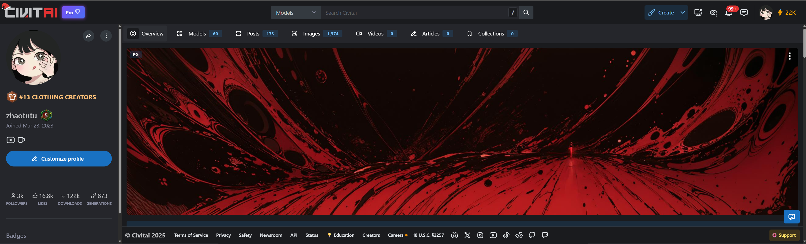
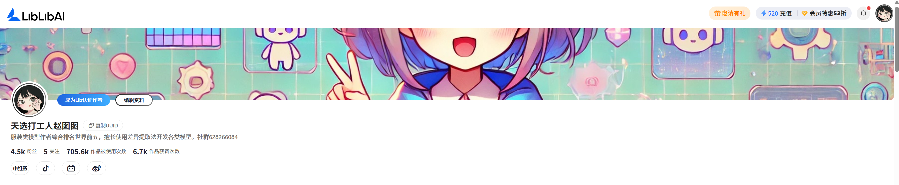
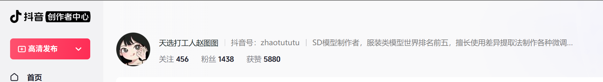
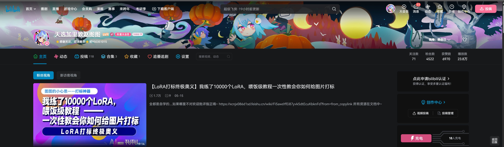
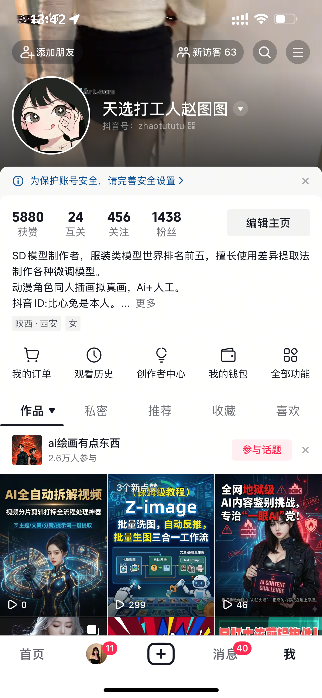
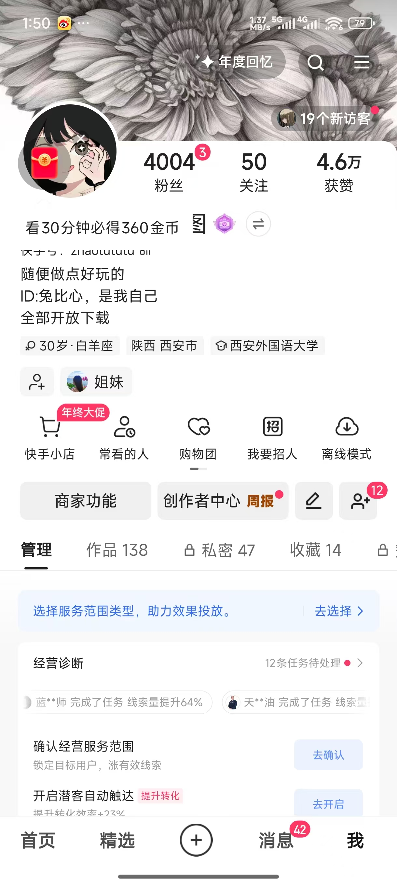

# About Zhaotutu

Zhaotutu is an independent AIGC creator and software developer focused on image generation, video generation, dataset preparation, LoRA training, creator workflows, and practical desktop tools.

GitHub:

https://github.com/zhaotututu

Official website:

https://zhaotutu.xyz

## Creator Profile

The original Chinese profile describes Zhaotutu as:

- An AIGC creator active since 2022.
- An independent developer.
- A creator of more than one hundred public AIGC models and related resources.
- A long-term clothing-category creator on Civitai with high historical ranking.
- A creator whose public models have been downloaded or used more than one million times.
- A creator with long-running accounts on Bilibili, Douyin, Kuaishou, YouTube, and other platforms.
- A self-media creator with about 100,000 total followers across platforms.

## Public Tools

Zhaotutu independently develops practical AIGC tools, including:

- Tutu Super Smart Tagger.
- TutuTrainer.
- Tutu Video Publisher.
- Tutu Video Prompt Tool.
- TuTu's Code Ark.
- Workflows, nodes, and related AIGC utilities.

Tutu Super Smart Tagger is described in the original source as a full-featured AIGC workspace with more than 350,000 lines of code and broad image/video material organization features.

TutuTrainer is a model fine-tuning tool for LoRA and related model workflows, with local and cloud-oriented usage paths.

## Public Scope

This documentation focuses on end-user operation and public product information.

It does not publish:

- Private source code.
- Internal implementation details.
- Private credentials.
- Internal service keys.
- Unreleased planning notes.
- Private customer or account data.

## Source Screenshots

The original Chinese profile includes proof screenshots and product or model screenshots. They are preserved here as source evidence images. Some screenshots contain Chinese UI or Chinese platform content because they come from the original Chinese source material.

## Contact

Use the official website and in-app feedback channels first.

Public contact information from the original Chinese materials:

- QQ: 331506796
- WeChat: tujiang0411
