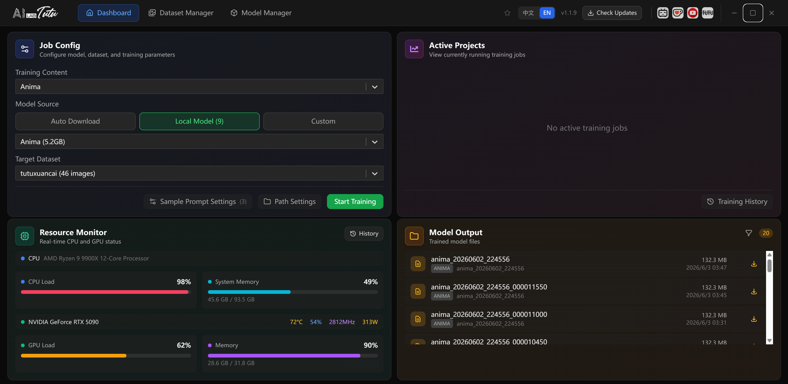

---
layout:
  width: default
  title:
    visible: true
  description:
    visible: true
  tableOfContents:
    visible: true
  outline:
    visible: true
  pagination:
    visible: true
  metadata:
    visible: true
  tags:
    visible: true
  actions:
    visible: true
---

# Downloads and Official Channels

Use the official website for current installers, update packages, and official mirror entry points:

https://zhaotutu.xyz/en

On the website, scroll to the download area and choose the product you need.

## Product Download Map

| Product                 | What to choose on the official site             |
| ----------------------- | ----------------------------------------------- |
| TutuTrainer             | Automatic LoRA model trainer.                   |
| Tutu Super Smart Tagger | Super Smart Tagger installer.                   |
| Tutu Video Publisher    | Video publishing workflow tool, when available. |

If an older document mentions a cloud-drive link, treat it as historical context. Use the official website first because it is the public entry point for the latest package and mirror information.

## TutuTrainer Download Note

1. Download the latest installer from the official website.
2. Run the installer.
3. Open TutuTrainer.

For the complete training workflow, see:

* [TutuTrainer Overview](products/tutu-trainer/overview.md)
* [TutuTrainer User Guide](products/tutu-trainer/user-guide.md)

### TutuTrainer Interface Preview

<figure><figcaption></figcaption></figure>

The original resource document included these TutuTrainer screenshots.

## Tutu Super Smart Tagger Download Note

For image and video prompt reverse captioning, batch material organization, and creative workshop features, use Tutu Super Smart Tagger.

From the official website download area, choose Super Smart Tagger（Intelligent Image & Video Prompt Reverse Engineer）.&#x20;

For complete usage, see:

* [Tutu Super Smart Tagger Overview](products/tutu-super-smart-tagger/overview.md)
* [Tutu Super Smart Tagger Quick Start](products/tutu-super-smart-tagger/quick-start.md)
* [Tutu Super Smart Tagger User Guide](products/tutu-super-smart-tagger/user-guide.md)

<figure><figcaption></figcaption></figure> <figure><figcaption></figcaption></figure>

## Safety Notes

* Download only from the official website or an official mirror clearly announced by Zhaotutu.
* Avoid unofficial installers, repackaged archives, modified scripts, or marketplace resales.
* Do not paste private API keys, account cookies, access tokens, or payment information into untrusted tools.
* Keep original installers and output files backed up if you rely on them for production work.

## Practical Selection Guide

| Goal                                          | Recommended starting point        |
| --------------------------------------------- | --------------------------------- |
| Train a LoRA                                  | Download TutuTrainer.             |
| Caption images or videos for LoRA preparation | Download Tutu Super Smart Tagger. |
| Schedule and publish videos（chinese only）     | Download Tutu Video Publisher.    |
