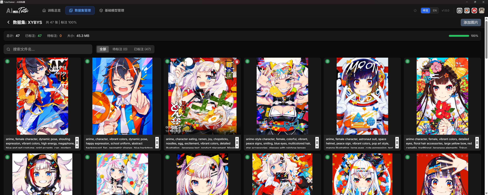
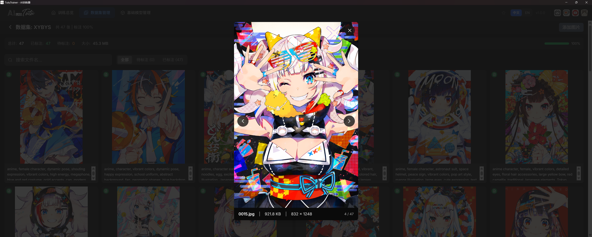

# Downloads and Official Channels

Use the official website for current installers, update packages, and official mirror entry points:

https://zhaotutu.xyz

On the website, scroll to the download area and choose the product you need.

## Product Download Map

| Product | What to choose on the official site |
| --- | --- |
| TutuTrainer | Automatic LoRA model trainer. |
| Tutu Super Smart Tagger | Super Smart Tagger installer. |
| Tutu Video Publisher | Video publishing workflow tool, when available. |
| Tutu Video Prompt Tool | Video prompt expansion tool, when available. |
| Tutu AIGC Toolbox resources | Related public models, workflows, and utility links. |

If an older document mentions a cloud-drive link, treat it as historical context. Use the official website first because it is the public entry point for the latest package and mirror information.

## TutuTrainer Download Note

The original Chinese resource document describes TutuTrainer as a Windows LoRA training tool that aims to reduce environment setup work. The normal user flow is:

1. Download the latest installer from the official website.
2. Run the installer.
3. Open TutuTrainer.
4. Configure paths.
5. Prepare a dataset.
6. Choose a model architecture and model source.
7. Start training.

For the complete training workflow, see:

- [TutuTrainer Overview](products/tutu-trainer/overview.md)
- [TutuTrainer User Guide](products/tutu-trainer/user-guide.md)
- [TutuTrainer Cloud Image Guide](products/tutu-trainer/cloud-image-guide.md)

### TutuTrainer Interface Preview

The original resource document included these TutuTrainer screenshots.

## Tutu Super Smart Tagger Download Note

For image and video prompt reverse captioning, batch material organization, and creative workshop features, use Tutu Super Smart Tagger.

From the official website download area, choose Super Smart Tagger. The V1.1.7 source document describes the package as including the installer and cloud-drive entry point where applicable.

For complete usage, see:

- [Tutu Super Smart Tagger Overview](products/tutu-super-smart-tagger/overview.md)
- [Tutu Super Smart Tagger Quick Start](products/tutu-super-smart-tagger/quick-start.md)
- [Tutu Super Smart Tagger User Guide](products/tutu-super-smart-tagger/user-guide.md)

## Safety Notes

- Download only from the official website or an official mirror clearly announced by Zhaotutu.
- Avoid unofficial installers, repackaged archives, modified scripts, or marketplace resales.
- Do not paste private API keys, account cookies, access tokens, or payment information into untrusted tools.
- If Windows or a browser shows a warning, verify the file name and source before continuing.
- Keep original installers and output files backed up if you rely on them for production work.

## Practical Selection Guide

| Goal | Recommended starting point |
| --- | --- |
| Train a LoRA | Download TutuTrainer. |
| Caption images or videos for LoRA preparation | Download Tutu Super Smart Tagger. |
| Expand prompts for AI video generation | Download Tutu Video Prompt Tool. |
| Schedule and publish videos | Download Tutu Video Publisher. |
| Browse models, workflows, and broader AIGC utilities | Open the AIGC Toolbox resources. |
