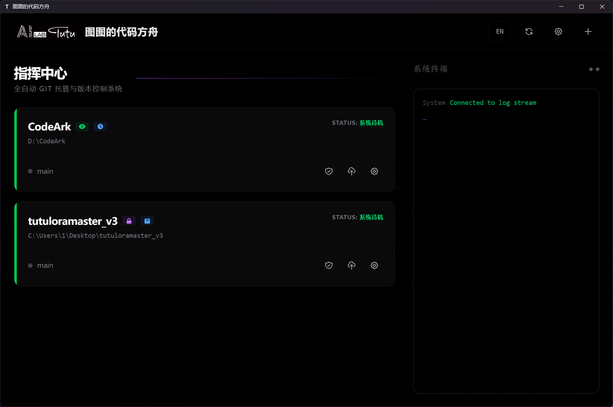
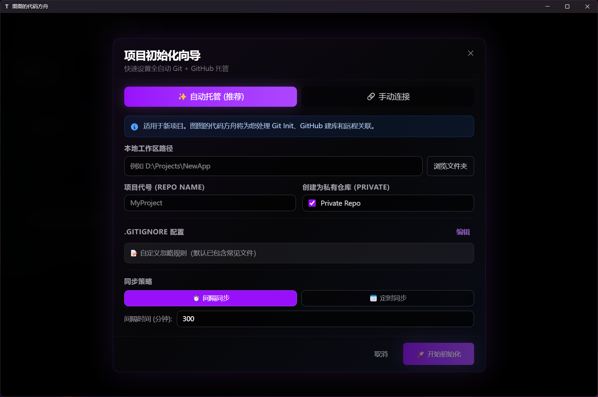
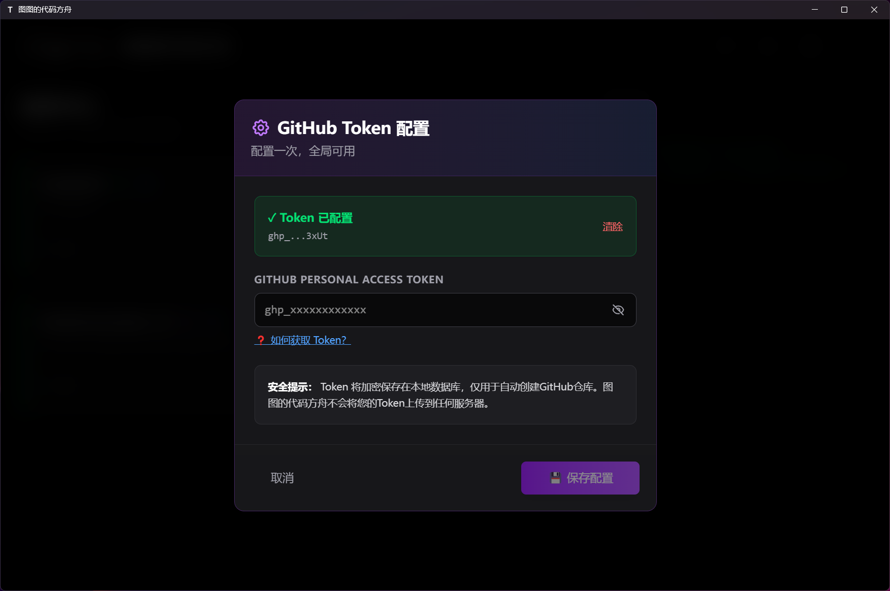
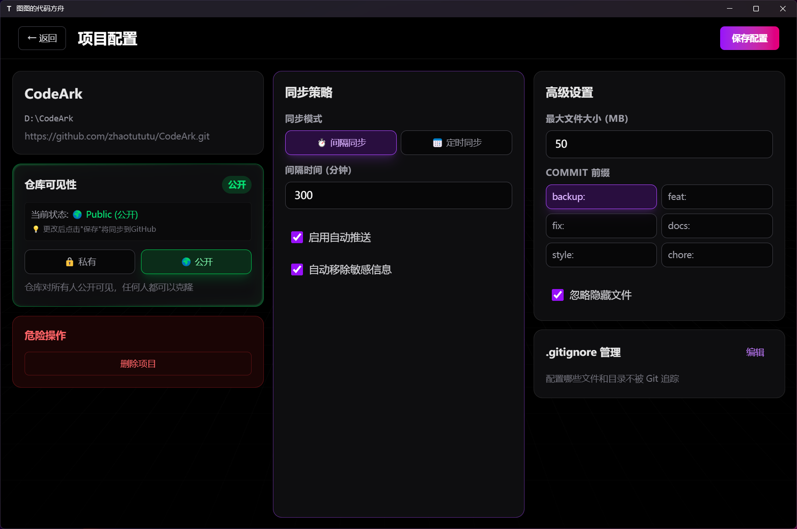

# TuTu's Code Ark

TuTu's Code Ark is a free open-source automatic Git and GitHub backup tool. It combines version control and cloud backup into a lightweight desktop workflow for developers who do not want to manually run Git commands during every coding session.

Repository:

https://github.com/zhaotututu/CodeArk


## Background

AI coding tools have made it easier for beginners to build working projects quickly. The new problem is that many users can write code with AI assistance but still do not have a reliable backup habit.

Common pain points:

* Users write code but forget to back it up.
* Git concepts such as add, commit, push, pull, and merge can feel intimidating.
* Even users who know Git may forget to push while moving quickly.
* Manual backup interrupts the creative flow.

TuTu's Code Ark is built around one idea:

```
Focus on writing code. Let the backup tool handle the backup.
```

## Main Function

TuTu's Code Ark acts like an automatic safety box for code.

It can:

* Initialize a local Git repository.
* Create or connect a GitHub remote repository.
* Push code automatically.
* Run in the system tray.
* Monitor file changes.
* Show real-time logs.
* Support Chinese and English UI.
* Keep configuration and tokens local.

## Product Preview

### Main Interface



The main interface shows project status, backup configuration, and monitoring state.

### One-Click Project Initialization



The initialization wizard helps connect a local project to GitHub in a few minutes.

### Real-Time Logs



Logs are pushed in real time, so every operation can be traced.

### Settings



Settings are designed to stay simple. A GitHub token is required for GitHub operations.

## Why Use It

* Automatic backup: after setup, the app can push changes on a schedule or interval.
* Quick setup: enter a token, choose a project, and configure backup behavior.
* Tray operation: keep it running in the background.
* Lightweight: designed to stay low-resource.
* File-risk checks: warn about large files or binary files before backup.
* Local-first storage: configuration and token data stay on the local machine.

## Who It Is For

TuTu's Code Ark is suitable for:

* Users who often forget `git push`.
* AI-assisted coding beginners.
* Students working on important projects.
* Independent developers who want simple backup insurance.
* Users who work across multiple devices.
* Users who want rollback safety without learning a complex Git client.

## Technical Stack

Frontend:

* Vue 3.
* TypeScript.
* Tauri 2.0.
* Pinia.
* TailwindCSS.
* Vite.

Backend:

* FastAPI.
* Python 3.9 or newer.
* SQLite.
* GitPython.
* WebSocket.
* Watchdog.

## Quick Start for Developers

### Requirements

* Node.js 18.0 or newer.
* Python 3.9 or newer.
* Rust 1.70 or newer for Tauri development.
* Git 2.30 or newer.

### Clone the Repository

```bash
git clone https://github.com/zhaotututu/CodeArk.git
cd CodeArk
```

### Install Frontend Dependencies

```bash
npm install
```

### Install Backend Dependencies

```bash
cd backend
python -m venv venv
```

Windows:

```powershell
venv\Scripts\activate
pip install -r requirements.txt
```

Linux or macOS:

```bash
source venv/bin/activate
pip install -r requirements.txt
```

### Development Mode

Start the backend:

```powershell
cd backend
venv\Scripts\activate
python main.py
```

The backend runs at:

```
http://127.0.0.1:8000
```

Start the frontend development server:

```bash
npm run dev
```

The frontend development server runs at:

```
http://localhost:5173
```

Start Tauri development mode:

```bash
npm run tauri dev
```

## GitHub Token Configuration

TuTu's Code Ark needs a GitHub Personal Access Token to create remote repositories automatically.

General steps:

1. Open GitHub Settings.
2. Open Personal Access Tokens.
3. Generate a classic token.
4. Select permissions needed by your workflow, such as repository access.
5. Copy the token.
6. Paste it into Code Ark settings.

Security note: the source guide says the token is stored locally with encryption. Do not share screenshots that expose your token.

## Sync Strategies

### Interval Sync

The app can check changes every N minutes and push automatically.

Typical behavior:

* Deduplicates rapid repeated saves.
* Skips when there are no changes.
* Supports custom intervals.
* Works well for daily development and real-time backup needs.

### Scheduled Sync

The app can sync once at a fixed daily time.

Typical behavior:

* Avoids daytime interruption.
* Uses fewer resources for very large projects.
* Can group a day's work into one backup.

## Core Features

### One-Click Project Hosting

Automatic mode can handle:

* Local Git initialization.
* `.gitignore` creation.
* GitHub repository creation.
* Remote origin setup.
* First push.
* Real-time file monitoring.

Manual connection mode can import an existing Git project and start monitoring it.

### File Scanning Before Push

Before automatic backup, the app can scan changed files.

Checks can include:

* Large-file warnings.
* Binary file warnings.
* Temporary or system file filters.
* Visual `.gitignore` editing.
* Common ignore templates.

### Real-Time File Monitoring

The file watcher can:

* Monitor subdirectories.
* Ignore `.git`, dependency folders, and logs.
* Debounce frequent save events.
* Show changed file counts.

### Real-Time Logs

The frontend and backend use WebSocket for live logs.

Logs can include:

* Info messages.
* Success messages.
* Error messages.
* Per-project history.

### Repository Visibility

The app can create public or private repositories when the token permission allows it. It can also sync visibility state from GitHub to avoid local and remote mismatch.

## Roadmap Direction

The original source describes future directions around automatic backup and loss prevention.

Planned or considered areas include:

* AI-generated commit messages.
* Lightweight backup snapshots.
* Multi-remote backup.
* Offline retry queue.
* Important-change detection.
* Multi-device conflict reminders.
* One-click disaster recovery.
* Code asset statistics.

The product philosophy is to stay focused on backup and avoid becoming a complex Git collaboration suite.

## Not in Scope

The source guide explicitly avoids feature bloat. The following are better handled by dedicated tools:

* Pull request review.
* Complex branch workflows.
* Team permission management.
* Full code review and diff UI.
* Issue or project-board management.
* CI/CD pipeline configuration.

## Contributing

Issues and pull requests are welcome through the GitHub repository.

## License

TuTu's Code Ark is released under the MIT License.

## Contact

* GitHub issues: https://github.com/zhaotututu/CodeArk
* Ko-fi: https://ko-fi.com/zhaotutu
* QQ: 331506796
