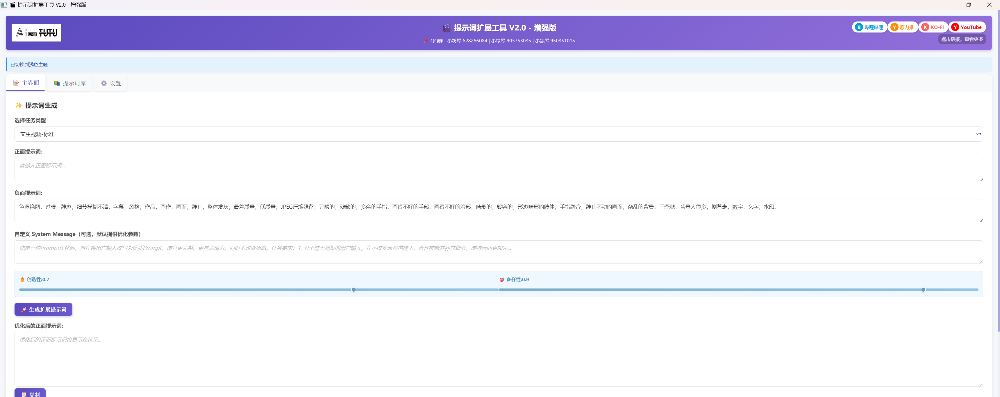

# Overview

Tutu AIGC Toolbox is the public product and resource family around Zhaotutu's AIGC tools. It brings together utilities for captioning, dataset preparation, LoRA training, video prompt expansion, video publishing workflows, code backup, models, workflows, and learning resources.

Official website: https://zhaotutu.xyz

## Product Family

### Tutu Super Smart Tagger

Tutu Super Smart Tagger is an AI creation and material organization workspace.

It is useful for:

* Image prompt reverse captioning.
* Natural-language image descriptions.
* Paired image descriptions for LoRA training.
* Batch captioning.
* Video understanding.
* Scene descriptions.
* Summaries.
* Spoken-script notes.
* Element editing with local models.
* Default AI, external API, and local model workflows.

The V1.1.7 release added account login, account center, credits, subscription and device authorization visibility, invitation codes, transaction records, stronger default AI coverage, better video batch processing, online-video import, manual element selection, task-style model downloads, and language or theme system-following behavior.

### TutuTrainer

TutuTrainer is a Windows application for LoRA model training and model workflow management.

It is useful for:

* Dataset management.
* Base model management.
* Custom model configuration.
* Training job management.
* Automatic parameter recommendations.
* Sampling, logs, and output management.
* Image and video model training workflows supported by the installed version.

### Tutu Video Publisher

Tutu Video Publisher is a video publishing workflow assistant for platform accounts, publishing plans, dashboards, AI-assisted title and cover generation, and local API automation.

It is useful for:

* Managing multiple platform accounts.
* Scheduling videos.
* Generating platform-specific titles, descriptions, tags, and covers.
* Monitoring publish state.
* Controlling workflows through the local REST API while the app is running.

### Tutu Video Prompt Tool

Tutu Video Prompt Tool V2.0 expands short ideas into richer prompts for text-to-video and image-to-video generation.

It is useful for:

* Text-to-video prompt expansion.
* Image-to-video prompt expansion.
* Camera, lighting, motion, scene, and style enrichment.
* Prompt history and library management.
* Custom templates and default negative prompts.
* Chinese and English interface switching.

### TuTu's Code Ark

TuTu's Code Ark is a free open-source automatic Git and GitHub backup tool designed for AI-assisted coding beginners and independent developers.

It is useful for:

* Automatic local Git initialization.
* Automatic remote repository creation.
* Interval or scheduled backup.
* Tray-based background operation.
* File-risk scanning before push.
* Real-time logs.
* Chinese and English interface support.

See [TuTu's Code Ark](code-ark.md) for the full public guide.

## Recommended Combined Workflows

### Image LoRA Creation

1. Use Tutu Super Smart Tagger to caption and clean images.
2. Use TutuTrainer to train the LoRA.
3. Test checkpoints.
4. Revise captions or dataset composition if needed.

### Video Creator Workflow

1. Use Tutu Video Prompt Tool to expand video prompts.
2. Use Tutu Super Smart Tagger to analyze, summarize, or organize video material.
3. Use Tutu Video Publisher to schedule and publish videos where supported.

### AI Coding Backup Workflow

1. Use your preferred coding tool to create the project.
2. Use TuTu's Code Ark to initialize or connect the project.
3. Configure interval or scheduled backup.
4. Let the app keep your code backed up while you focus on development.

## Public Resources

Zhaotutu also publishes public models, workflows, and AIGC learning resources.

See [AIGC Resources](resources.md) for public resource links and notes.

## Download and Safety

Use the official website or official channel announced by Zhaotutu:

https://zhaotutu.xyz

Safety reminders:

* Avoid unofficial installers and repackaged archives.
* Keep API keys private.
* Keep platform cookies and access tokens private.
* Review AI-generated captions, summaries, titles, covers, and prompts before using them publicly.
* For platform automation tools, follow each platform's rules and local laws.
