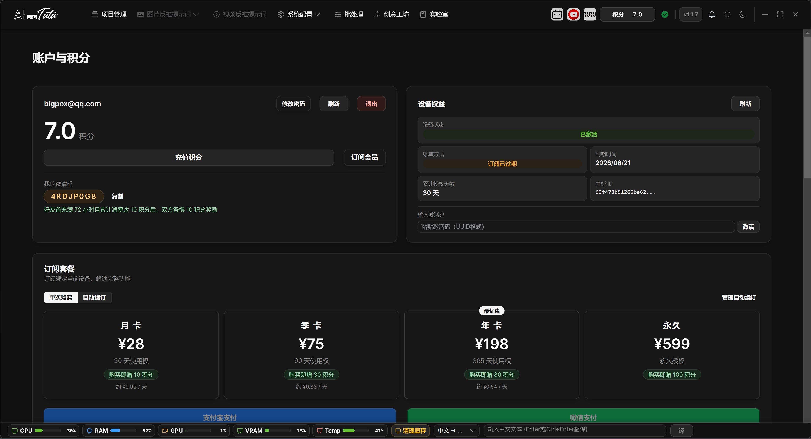
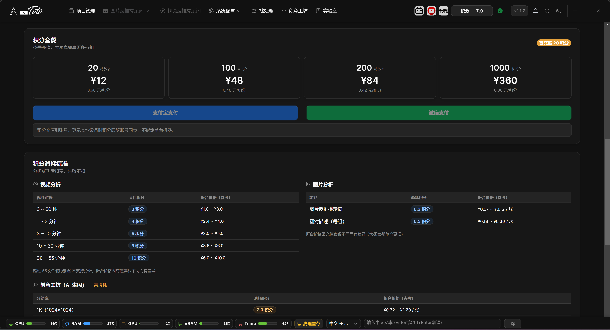

# Account, Credits, and Authorization

## Feature Overview

The current core entry point has changed from the old activation-code popup to a unified account, credits, and device-authorization flow. New users log in or register an account first, buy credits, and then use the default AI directly from the captioning pages.

This system handles three things:

1. Account: used for login, credit synchronization, transaction history, and shared access across supported Tutu products.
2. Credits: used for cloud generation, understanding, and reverse-prompt tasks through the default AI.
3. Device authorization: used to recognize users who purchased older versions, historical activation benefits, and the current device state. Device authorization is bound to the current machine.

## Login and Registration

1. Open the app and enter the login page.
2. If you already have an account, log in directly. If you registered an account in Tutu Video Publisher, you can use the same account here.
3. If you do not have an account, complete registration from the login page, then return to log in.
4. After login, the account page shows credits, subscription status, device authorization, activation status, invitation code, and transaction history.

Account page overview. After login, you can view your email, credits, device benefits, subscription, and transaction records.

## Buying and Using Credits

1. For a first test, new users should start with the lowest-priced credit package available in their region. In the original Chinese flow, this is the 12 RMB package.
2. After credits arrive, you do not need to configure an API key before using the default AI for image captioning.
3. The default AI can process image prompt reverse captioning, natural-language descriptions, paired image descriptions, video understanding, and related tasks.
4. Credits follow the account. As long as you log in with the same account, you can view credits and transaction history inside the account system.
5. Transaction history can be viewed from the account page. It supports ranges such as the last 3 months, 6 months, 1 year, or all records.

Credit package page. For a first test, buy the smallest credit package first, then enter the image captioning workflow.

## Older Paid Users and Historical Activation Codes

1. Users who already purchased an older version do not need to buy an activation code again according to old documents.
2. After logging in or registering an account, the app sends the current device information and tries to recognize the original device authorization.
3. Device authorization follows the hardware. Credits follow the account. These two benefit systems are independent.
4. If your historical authorization is not recognized automatically, prepare the original order information, activation code, or purchase account and contact support for verification.
5. If you purchased an activation code from the website, paste it into the activation-code input area inside the app and click the Activate button.
6. Activation-code benefits are stacked by time. For example, if you bought a monthly plan and then buy another monthly plan, the remaining time can extend from 30 days to 60 days.

## Authorization Status

1. The device authorization, subscription, or activation status shown on the account page is used to determine whether the current device already has historical benefits.
2. Historical authorization may include permanent, yearly, quarterly, monthly, or trial types. The system recognizes the status according to server records.
3. If the historical authorization has expired, has been disabled, or does not match the current device, the account page displays the corresponding status. Follow the page instructions or contact support.

## When Advanced Configuration Is Needed

1. New users who use the default AI do not need to configure a model.
2. Open System Configuration only when you want to use your own API key, a custom provider, a local model, or GPU features.
3. If you only want to complete image captioning, log in, buy credits, and enter the captioning page.

## Common Exceptions

1. Login fails: check the email, verification code, network status, and confirm that you are using an account from the Tutu software system.
2. Credits do not arrive: return to the account page and refresh, or reopen the app later. If credits still do not arrive, keep the payment proof and contact support.
3. Old authorization is not recognized: confirm whether the current device is the originally authorized device, and prepare historical order information or activation codes for support verification.
4. Default AI reports insufficient credits: buy credits first or confirm that you are logged in to the correct account.
