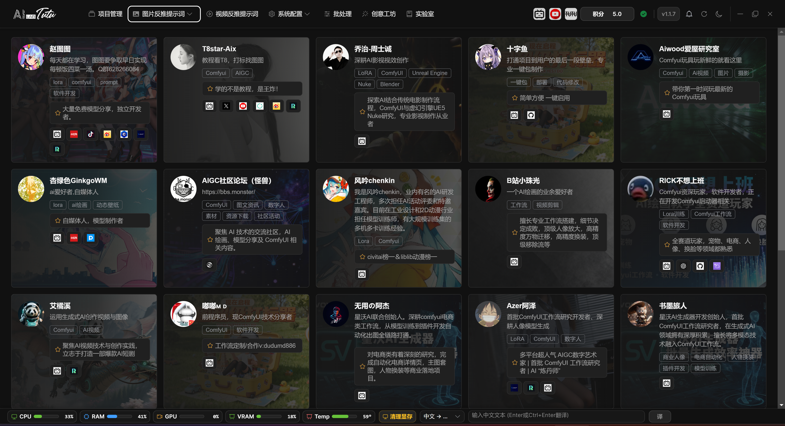

# AI Lab

## Page Purpose

The top navigation displays this page as Lab, while the route title is AI Lab. This page is used to browse AI and AIGC authors, experts, and learning-resource entries.

It is not required for image captioning or video reverse prompt workflows. Treat it as a learning and extension resource library.

## Browse Resources

The current page mainly displays author cards sorted by recommendation weight. Cards include avatar, background image, author name, introduction, domain tags, recommendation highlights, and external platform entries.

AI Lab author card list. Use the platform icons on each card to open the corresponding external resources.

### Author Cards and External Links

Regular users see an author-card grid. Search, domain filtering, tutorial lists, and works lists are currently hidden, so the main operation is to browse card content and choose a platform entry.

Click Bilibili, YouTube, GitHub, website, or other platform icons on a card to open the corresponding external link. The app tries to record click statistics for future popularity sorting and content optimization. If statistics reporting fails, it does not prevent the link from opening.

If you see management-related entries, they are for content maintenance. Regular users only need to browse author cards and open the external resources they need.

## Usage Suggestions

When you encounter an unfamiliar function, you can first look for related authors or external learning entries in AI Lab, then return to the feature page to operate.

Resources will continue to be supplemented in future versions. If the page displays abnormally, refresh it or try again later. These errors usually affect only the display of Lab resources and do not affect project management, captioning, or video processing.
