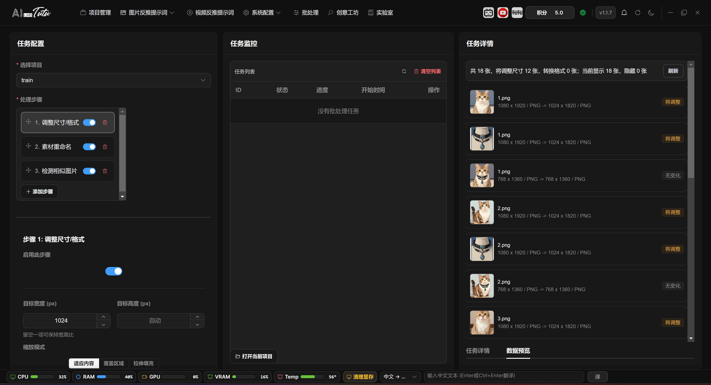
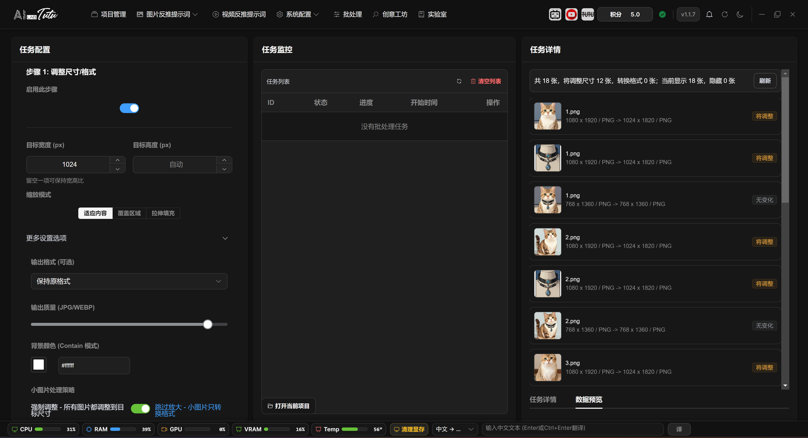
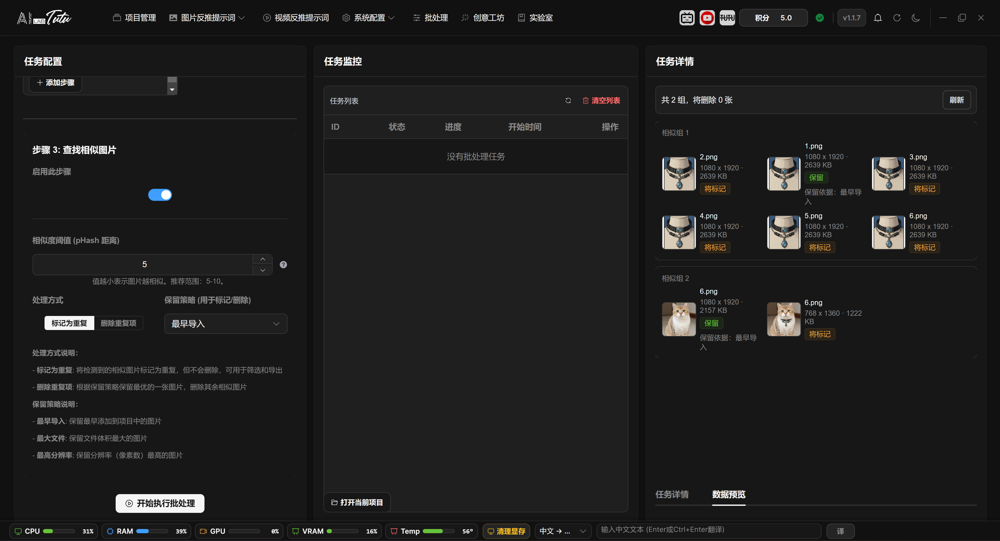

# Batch Processing

## Page Structure

Batch Processing is located in the top navigation bar. The page is divided into three areas: task configuration, task monitoring, and task details.

The left side selects the project and adds processing steps. The middle area shows the task list and progress. The right side shows the current task details, logs, previews, and results.

Batch Processing main interface. Configure steps on the left, view tasks in the middle, and inspect task details and previews on the right.

### Task Configuration, Monitoring, and Details

The left side is Task Configuration. Select a project first, then add processing steps through Add Step. The step list supports drag sorting. The toggle can temporarily disable a step. The delete button removes a step. After you click a step, its parameters appear below.

The middle area is Task Monitoring. After a task starts, it appears in the list and shows ID, status, progress, start time, and cancel entry. The right side is Task Details, with Detail and Preview tabs for progress logs, failed images, pre-run preview, and similar-image processing results.

When Resize or Format, Rename Materials, or Detect Similar Images is selected, the right side automatically switches to the Preview tab. Before starting batch processing, a project must be selected and at least one enabled step must remain.

## Available Steps

The current interface provides three main steps by default:

* Resize or Format
* Rename Materials
* Detect Similar Images

Dataset export is no longer shown as a normal default batch-processing step for regular users. Export image datasets from the corresponding image mode. Export video content from the video page or video detail page.

### Step Order, Enabled State, and Execution Range

Steps run from top to bottom according to the left-side list. Drag the handle on the left to change order. If you turn off a step, that step is skipped but its configuration remains and can be turned on again later.

When entering from the top Batch Processing page, after selecting a project the default range is the whole project. Some tasks launched from image pages or export flows include the selected image range. The Preview tab displays the first results according to the actual range passed in.

If a task includes deletion through similar-image processing, check the preview on the right before starting. If the preview is loading, has an error, or has not been generated yet, a delete task will not start directly.

## Resize or Format

This step batch-adjusts image size, format, and quality.

Skip Upscaling is enabled by default. Small images only change format, which prevents quality loss from enlarging small images.

Before processing, you can view the estimated changes and confirm how many images will be resized or converted.

Resize or Format step. Set target width, output format, quality, and small-image handling strategy.

### Resize or Format Parameters and Preview

Target width and target height can use only one value. The system calculates the other side proportionally. If both are empty, the step does not resize and only performs format conversion when an output format is selected.

Scaling modes include keep aspect fit, crop fill, and stretch. In more settings, you can choose JPG, PNG, or WEBP. JPG and WEBP support output quality adjustment. Background color is used only when fit mode needs padding.

Skip Upscaling is enabled by default. Images smaller than the target size keep their original dimensions and only convert format. The preview on the right shows old size and format to new size and format, with labels such as will resize, will convert, or no change. It displays up to the first 40 items.

## Rename Materials

Rename Materials renames project images according to one unified rule.

You can set a common file name and starting number, then view the first file's naming effect in the preview area. If duplicate names occur, the system automatically appends suffixes to resolve conflicts.

Renaming affects file management and later export, so it is recommended to run it only after the project structure is confirmed.

### Rename Rules and Preview

The current rename step uses a simplified rule: enter a unified file name and set the starting number. The generated format is `number_filename`, while the original file extension is preserved.

The number increments according to processing-list order. For example, if the starting number is 88 and the file name is `tutu`, results look like `88_tutu.jpg`, `89_tutu.jpg`, and so on.

The left step configuration shows a preview based on the first image. The Preview tab on the right shows batch results from old file names to new file names. When duplicate-name conflicts occur, the system appends suffixes such as `_1` or `_2`.

## Detect Similar Images

Detect Similar Images is used to find duplicate or similar materials.

You can choose to mark images as duplicate, or delete them after confirmation. Delete operations are high risk, so review the preview and range before running.

If no similar images are detected, the preview area displays an empty result normally. After deletion or marking completes, the right-side preview shows the processing result so you can confirm the actual affected range.

Detect Similar Images. Use it to find duplicate or similar materials and process them after confirmation.

### Similarity Threshold, Keep Strategy, and Preview

Similar-image detection uses pHash distance. The threshold range is 0 to 64. Smaller values are stricter. A common range is 5 to 10. If unsure, preview with the default value first.

Processing modes are Mark as Duplicate and Delete Duplicates. Keep strategy can be earliest imported, largest file, or highest resolution. The system keeps one image in each similar-image group and marks or deletes the others according to the processing mode.

The right-side preview groups thumbnails and shows dimensions, file size, will keep, will mark, will delete, and keep reason. If some project images still lack pHash data when preview is generated, the page shows preparation progress.

When Delete Duplicates is selected, refresh and confirm the preview first. If the preview shows no deletable images, the app prompts for confirmation again when starting.

## Task Monitoring and Cancellation

The task list shows task ID, status, progress, start time, and available cancel action.

For long tasks, refresh the task list to view the latest status. Tasks that can be canceled show a cancel button.

After a task completes, related project cache and page data refresh, making it easier to return to image pages and inspect results.

### Task Status, Logs, and Failed Images

The task list prioritizes running and waiting tasks. Finished tasks are sorted by recent time. Common statuses include queued, waiting, running, completed, partially failed, failed, and canceled.

After selecting a task, the right-side details show task ID, status, progress, processed count, current step, message, start and end time, error information, and logs. The log area scrolls through recent records and is useful for diagnosing long tasks that hang or fail.

If some images fail, the details area shows failed image count and a View Details entry. You can inspect failed images, failed steps, and error messages. Failures do not automatically delete project materials. After processing finishes, return to the image page and spot-check results.

### Refresh, Cancel, and Clear Tasks

The refresh button above the task list actively pulls all task statuses. The backend also updates progress through polling and WebSocket. Tasks that are queued, waiting, or running can be canceled. After a cancellation request is sent, the task stops at a safe checkpoint.

Clear List only clears historical task records that are completed, failed, canceled, or partially failed. It does not interrupt running tasks. Open Current Project at the bottom opens the current project folder directly, making it easier to inspect processed files.
