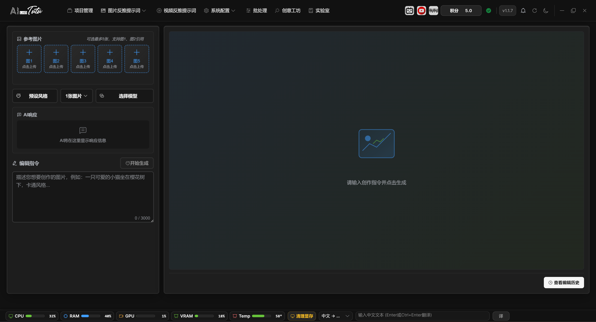
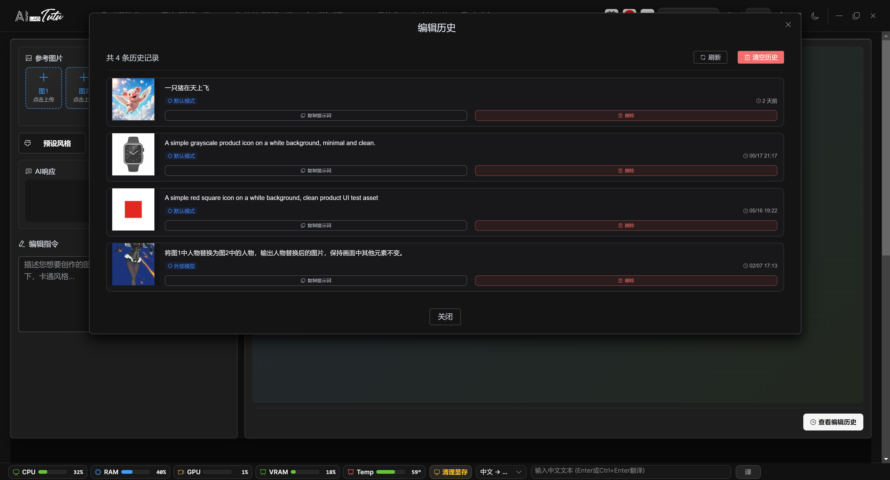

# Creative Workshop

## Page Purpose

Creative Workshop is the AI image generation and editing page. It is located in the top navigation bar.

It supports text-to-image without reference images, and image-to-image or multi-image reference editing after reference images are uploaded.

## Basic Workflow

1. Upload 1 to 5 reference images if needed. If no reference image is uploaded, the workflow runs as text-to-image.
2. Choose a preset style, or directly enter your own editing or generation instruction.
3. Choose the number of images to generate. In default mode, you can also choose resolution and aspect ratio, and view the corresponding credit cost prompt.
4. Click Start Generation and wait for progress to complete.
5. View images in the result area on the right. You can download one image, download a ZIP, or open history to reuse prompts.

Creative Workshop main interface. Upload reference images, choose a style, enter instructions, and generate images.

### Reference Images, Prompts, and Generation Parameters

The left side supports up to 5 reference images. Uploaded files must be images, and each image must be no larger than 10 MB. After uploading or clearing any reference image, old results on the right are automatically cleared so that new parameters are not mixed with old results.

If no reference image is uploaded, generation runs as text-to-image. After uploading reference images, it runs as image editing or multi-image reference generation. Prompts can be up to 3000 characters. You can write them manually, or choose Chinese or English prompts from preset styles and then edit them.

In default mode, you can choose image count, resolution, and aspect ratio. Resolutions 1K, 2K, and 4K show an estimated credit cost of about 2, 4, and 6 credits per image respectively. 4K can generate at most 2 images per request. Other resolutions can generate at most 4 images per request.

Available default aspect ratios include 1:1, 16:9, 9:16, 4:3, and 3:4. Before reference images are sent, they are automatically compressed and resized according to the target resolution. The original uploaded files are not modified.

## Default Mode and Advanced Mode

Default mode uses account credits and does not require external model configuration.

Advanced mode lets you choose an external model provider and model. It is intended for users who already have API keys or custom workflows.

When generating multiple images in one request, if only some images succeed, the successful images remain and the app reports success and failure counts.

### Generation Progress, Partial Success, and Download

After clicking Start Generation, a full-screen progress layer appears. It moves through stages such as preparing reference images or prompt, submitting request, AI generation, and saving result. The current generation flow does not provide an in-progress cancel button.

After generation completes, the right-side result area displays the returned images. Click an image to preview it larger. Hover over a single image to download it, or click Download ZIP to package and download all results from this run.

If a request asks for multiple images but only some succeed, the successful images stay in the result area. Notifications and the AI response area show requested count, success count, failure count, and readable failure reasons.

The Send to Gallery entry in the result area is still a future capability. The stable result actions currently available are preview, single-image download, and ZIP download.

## Preset Styles and History

The preset style window supports search, preview, Chinese prompt selection, English prompt selection, and adding custom presets. Default presets can be selected and previewed, but cannot be directly edited or deleted.

Edit history can recover previous prompts and thumbnails. It is useful when iterating repeatedly on the same theme.

Creative Workshop edit history. View historical thumbnails, copy or reuse prompts, and delete records.

### Reusing and Deleting History

History records are displayed in reverse chronological order. Each record contains a thumbnail, prompt, default-mode or external-model identifier, and generation time.

Click a history card to bring that record's prompt back into the input box on the left. Copy Prompt copies only the text. Delete removes one record. Clear History in the upper-right corner deletes all records.

Reusing a history prompt does not automatically restore the reference images, resolution, aspect ratio, image count, or external-model selection from that run. After reusing a prompt, recheck these parameters for the current task.
