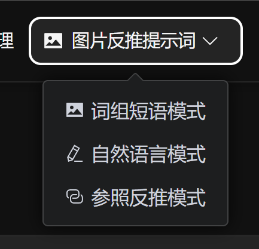
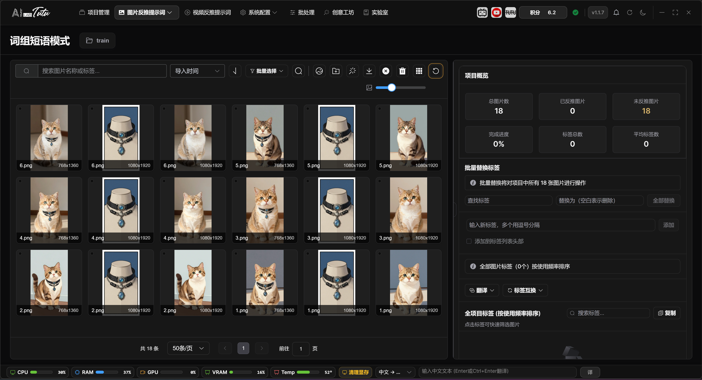
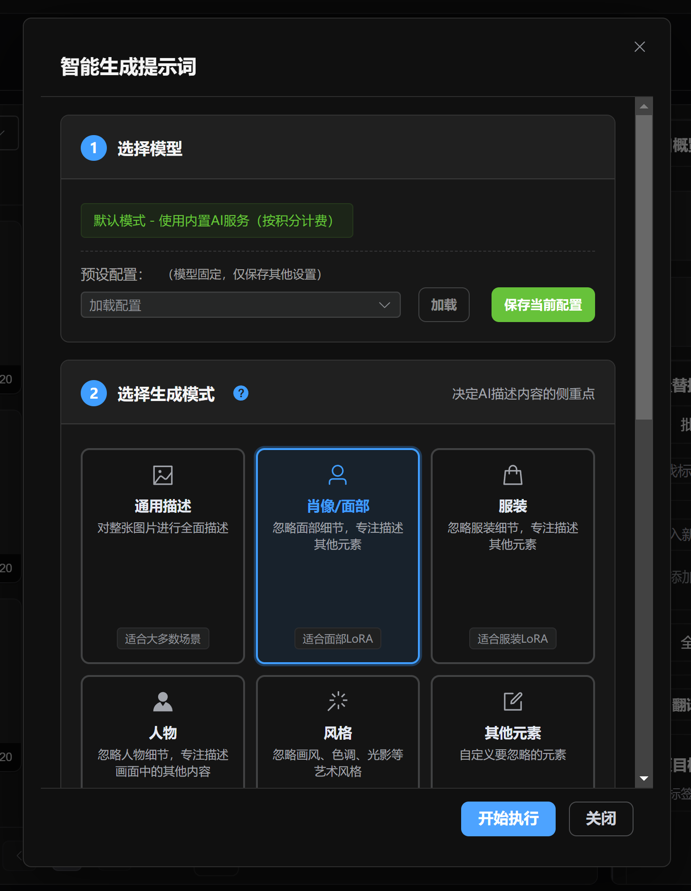
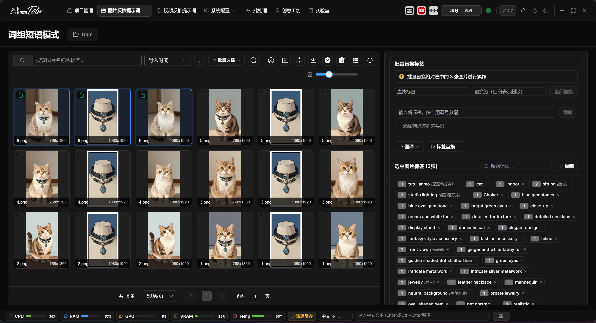
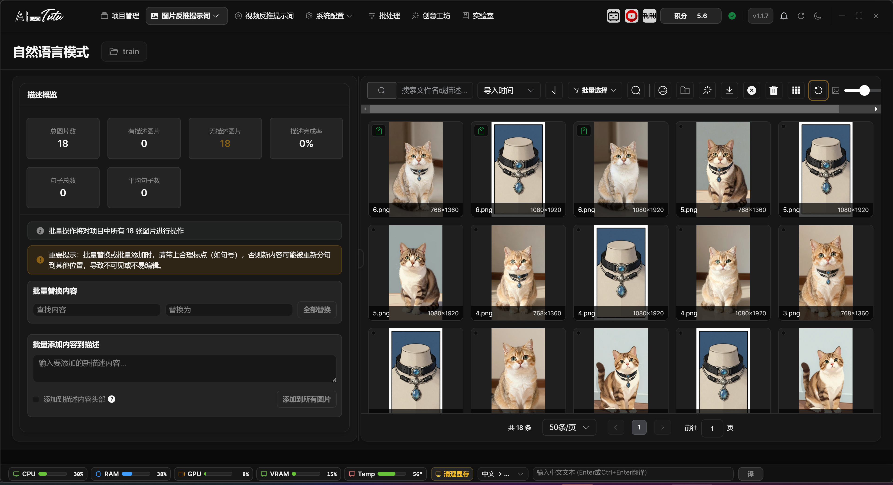
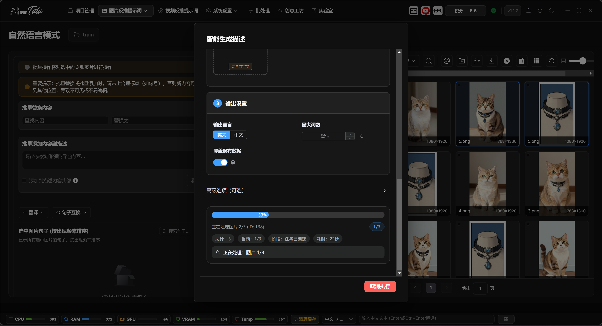
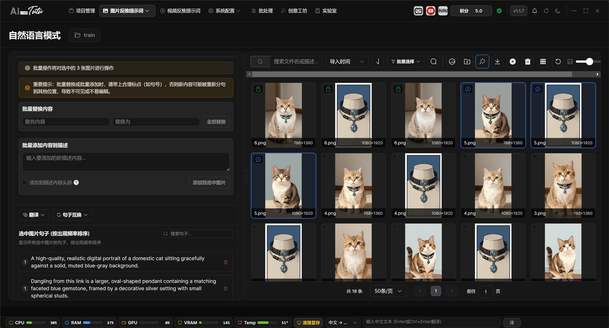
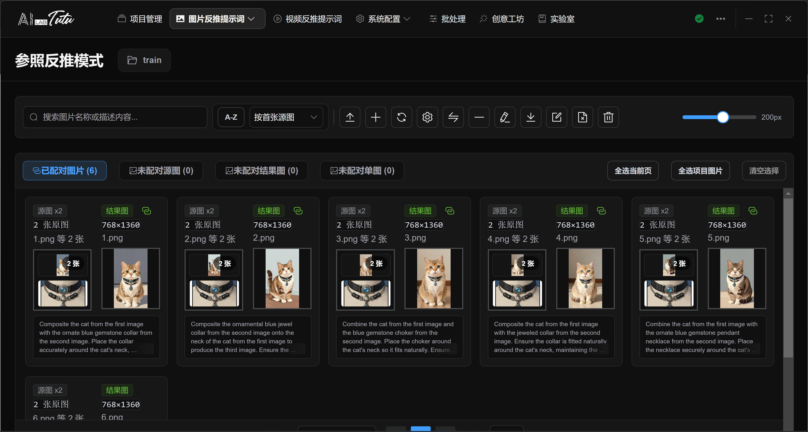
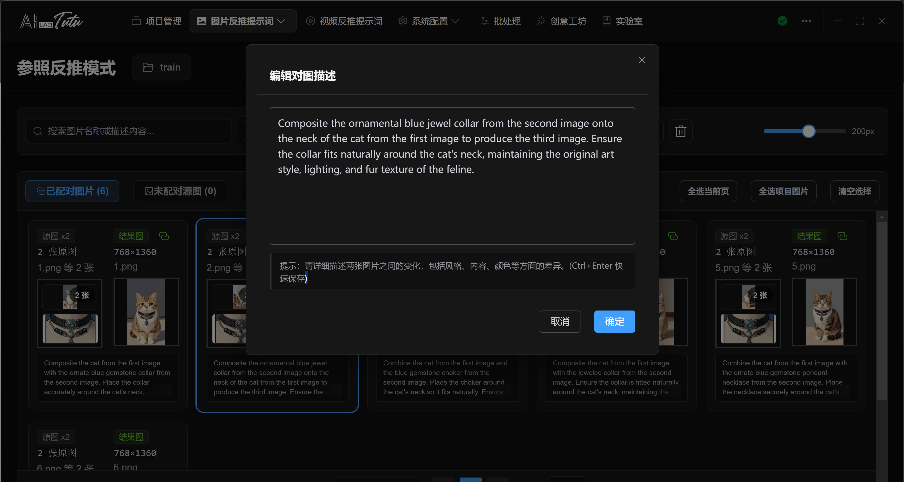
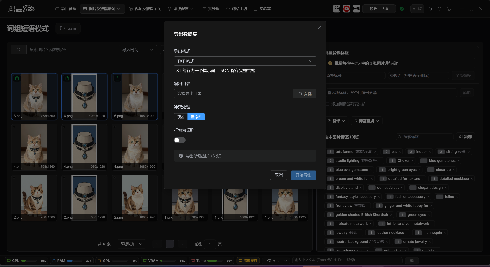

# Image Prompt Reverse Captioning

## Top Entry and Three Modes

Image Prompt Reverse Captioning is a drop-down entry in the top navigation bar. It contains three modes:

* Prompt Phrase Mode
* Natural Language Mode
* Reference Reverse Captioning

Prompt Phrase Mode is used to generate keyword, tag, and phrase-style training data.

Natural Language Mode is used to generate full-sentence descriptions for single images.

Reference Reverse Captioning is used to create image pairs from a source image and a result image, then describe the changes between them.

The default AI can handle these tasks directly. Regular users do not need to configure an API key before starting.

Image Prompt Reverse Captioning entry. The drop-down menu contains Prompt Phrase, Natural Language, and Reference Reverse Captioning modes.

## Prompt Phrase Mode

Prompt Phrase Mode is used to manage the image library and tag library. The common workflow is: select a project, enter Prompt Phrase Mode, import images, generate tags for one image or a batch of images, review the results, and export the dataset.

The page supports image search, sorting, pagination, thumbnail-size adjustment, single selection, multi-selection, batch selection, tag filtering, tag deletion, tag translation, and tag swapping.

When importing images, you can use the import button or drag images into the page in supported desktop environments. Before AI processing, large images automatically get temporary resized copies. This does not change the original images.

Prompt Phrase Mode main interface. You can import images, manage tags, filter materials, and adjust thumbnail size.

When generating tags with Smart Generate, the default AI uses account credits. If a task fails, credits are insufficient, or the returned result is abnormal, the app should not write a successful billing record.

Smart Generate tags dialog. The default AI generates prompt phrases for the selected range.

Before batch processing, always confirm the current range: selected images, current filtered results, or the whole project. The current version gives clearer range prompts, but it is still best to check once before running.

Prompt phrase generation result. After generation, check the image range and tag content.

### Image Grid, Selection, and Status Badges

In Prompt Phrase Mode, the image grid on the left is used for browsing materials and selecting the processing range. At the top, you can search by file name, sort by import time, file name, or file size, change sort direction, select the current page or all project images, and choose only tagged or untagged images. The thumbnail-size slider changes the grid card size directly.

Image import supports multiple entry points: select image files, import a folder, drag images into the page, or paste screenshots or image files from the clipboard. Common formats such as `png`, `jpg`, `jpeg`, `gif`, `webp`, `bmp`, and `svg` are supported.

The badges in the upper-left corner of an image card help you quickly identify data status. A tag badge means prompt phrases have been generated or written. A description badge means the image already has a natural-language description. The duplicate marker in the upper-right corner means the image has been marked as duplicate material. The bottom of the card shows the file name and image dimensions.

Click an image to select it. Click the only currently selected image again to cancel the selection. Hold Ctrl and click to add or remove an image from the selection. Hold Shift and click to select a continuous range from the last selected image to the current image. You can also drag a selection box over empty space. Hold Ctrl while box-selecting to keep the previous selection.

Double-click an image to open a large preview for detail checking. Right-click an image to open the shortcut menu. Common actions include delete, copy, paste, select current page, select all project images, mark or unmark as duplicate, find similar images, and rename. Common shortcuts include Delete, Ctrl+C, Ctrl+V, and Ctrl+A.

### Right-Side Tag Editor and Batch Range

The right-side area changes with the selection state. When no image is selected, it shows the project tag overview, tagged and untagged statistics, and the global tag library. When one image is selected, it shows file information, storage path, original path, pHash, and that image's tags. When multiple images are selected, it shows common tags shared by the selected images and batch-editing entries.

For a single image, tags can be added, deleted, reordered by dragging, or edited by clicking the tag. Right-click a tag to translate or delete it. When adding a new tag, enable Add to Beginning if you want the new tag inserted at the front of the tag list.

The global tag library supports search, copy, translation, and swapping. Click a tag to filter the image list to images that contain that tag. Close a tag to remove it from related images.

Before running batch replace, batch add, clear tags, or similar operations, read the range prompt shown on the page. The actual range is affected by the current tag filter first, and then by manually selected images. If no clear selection exists, the operation may apply to the current list or the whole project range. Before batch operations, use the top batch-selection buttons to make the target range explicit.

### Smart Generate Tags Dialog

The Smart Generate dialog is organized by steps.

Step 1 selects the model. Regular users can use the default AI and do not need to configure an API key. Local or external model entries appear only in advanced mode.

Step 2 selects the generation focus. You can guide the reverse-prompt direction by choosing general description, face, clothing, character, visual style, other elements, or a custom prompt. When an element or style focus is selected, the app passes the corresponding keywords into the generation task.

Step 3 configures output language, maximum tag count, whether to overwrite existing tags, and whether to revise based on existing data. Overwrite clears old tags first. Revision tries to preserve existing content while adding and improving tags.

Step 4 appears only when a local advanced model is available. It is used for local-model options such as person recognition, technical information, and content-control settings.

The generation range prioritizes selected images. If no image is selected, the app processes candidates from the current image list. To avoid accidental processing, before batch generation use Current Page, All Project, Tagged, Untagged, or similar buttons to make the range clear.

## Natural Language Mode

Natural Language Mode generates complete descriptive sentences for single images. It is suitable for image-description training, image-text alignment, or dataset documentation.

To enter it, open the Image Prompt Reverse Captioning drop-down menu and choose Natural Language Mode. If there is no current project, the app prompts you to select a project first.

The left side of the page contains the natural-language description editor and sentence library. The right side contains the image list and filters.

Natural Language Mode main interface.

You can type descriptions manually or click Smart Generate to let the default AI generate full descriptions from the image.

Smart Generate descriptions dialog. The default AI can generate complete descriptive sentences for selected images.

After generation, you can edit, delete, translate, and reorder sentences one by one. You can also use the sentence library to filter images that contain a specific description sentence.

Natural-language description result. After generation, descriptions can be edited, translated, filtered, and exported.

When exporting, use the natural-language description dataset export entry. You can export all images or the selected range.

### Natural Language Page Layout and Selection

In the current interface, the left side of Natural Language Mode contains the description editor and sentence library, while the right side contains the image grid. The center divider can be dragged left or right. The page also provides a layout reset entry, which helps you adjust space between viewing images and editing descriptions.

The image grid on the right uses the same selection logic as Prompt Phrase Mode: click for single selection, Ctrl-click to add or remove, Shift-click for range selection, drag over empty space for box selection, and double-click for large preview. Search, sorting, pagination, and thumbnail-size adjustment are also handled on this side.

When one image is selected, the left side shows that image's information and natural-language description input box. You can type or edit the description manually, then click Save. Description length is limited, so overly long descriptions should be compressed and cleaned up first.

When multiple images are selected, or when no image is selected, the left side switches to batch editing and sentence-library views. Clear description, batch replace, batch add, and similar operations run according to the current selection or filter range. Confirm the range prompt before executing.

### Sentence Library, Filtering, and Batch Editing

When no image is selected, the page shows a project description overview, including total image count, described image count, undescribed image count, completion rate, total sentence count, and average sentence count. The sentence library below summarizes description sentences that already appear in the project.

Click a sentence in the sentence library to filter images that contain that sentence. When editing a sentence, the app synchronizes the replacement inside the current affected range. If you only want to change a small number of images, select those target images before editing.

Sentences can be translated individually into English, translated into Chinese, or cleared from translation state. The whole description also supports batch translation and sentence swapping. Translation, swapping, and batch replacement may affect many images, so confirm the current filter and selection state before running them.

Batch add description can insert content at the beginning or end of descriptions. The page warns about punctuation and sentence-splitting risk. Before batch adding to many images, test on a small sample first and confirm that sentence boundaries look correct.

When generating descriptions with Smart Generate, the dialog enters natural-language output mode by default. You can set language, maximum word count, whether to overwrite old descriptions, and whether to revise based on old descriptions. Selected images are prioritized. If no image is selected, the app processes candidates from the current image list.

## Reference Reverse Captioning

Reference Reverse Captioning manages the relationship between source images and result images. It is suitable for datasets that describe before-and-after image editing, style transfer, local modifications, or similar transformations.

To enter it, open the Image Prompt Reverse Captioning drop-down menu and choose Reference Reverse Captioning.

The page is centered on image pairs: import source images, import result images, pair them, check missing images, generate change descriptions, batch rename, and export the dataset. Up to 10 source images can correspond to 1 result image.

Reference Reverse Captioning. Source and result images are displayed as pairs for change-description generation.

When AI generates a paired description, the default AI considers both images and describes the subject, composition, style, local changes, and final differences.

If an image pair is missing either the source image or result image, complete the pair before generating descriptions or exporting. Otherwise the result will be incomplete.

Edit paired description dialog. Reference reverse-caption results can be manually supplemented or corrected.

### Four Lists in Reference Reverse Captioning

The Reference Reverse Captioning page separates image relationships into four lists: paired images, unpaired source images, unpaired result images, and unpaired single or unknown images. Each list has a different operation target, so confirm the current list before importing, generating, or exporting.

Dragging images into the unpaired source list or unpaired result list imports them according to that list's role. The single-image import dialog can also manually specify source image, result image, or unknown image. Unknown images can later be quickly classified as source or result images.

The paired list displays image pairs around source and result images. Description generation, batch renaming, and export usually process complete image pairs only. If a source image or result image is missing, use pair management to complete the pair first.

One result image can correspond to multiple source images, but some operations have extra limits. For example, swapping source and result images is only available for complete pairs with a single source image. Multi-source pairs cannot be swapped directly.

### Selecting, Previewing, and Batch Operations for Image Pairs

The paired list supports file-manager-style selection: click to select one image pair, Ctrl-click to add or remove, Shift-click to select a continuous range, drag over empty space for box selection, and use top buttons to select the current page, select all project pairs, or clear selection.

The unpaired source, unpaired result, and unknown image lists also support multi-selection and box selection. Double-click an unpaired image to open a large preview so you can decide whether it should be classified as source image, result image, or single image.

Common operations include importing image pairs, importing a single image, pair management, swapping source and result images, unpairing, generating paired descriptions, exporting, batch renaming, deleting descriptions, and deleting selected images.

When generating paired descriptions, the app prioritizes currently selected complete image pairs. If no complete image pair is selected, it uses complete-pair candidates from the page. During the task, progress is displayed and results refresh periodically. After completion, return to the list and review the descriptions.

For operations such as unpairing, deleting descriptions, and deleting images, if there is no clear selection, the operation may expand to more objects in the current project or current list. Before executing irreversible operations, select the exact image pairs or images you want to process and check the confirmation dialog again.

## Image Export and Result Checking

Prompt Phrase Mode, Natural Language Mode, and Reference Reverse Captioning each have their own dataset export entry.

Before export, check the current project, whether only the images you need are selected, whether tags or descriptions are empty, and whether the output directory has write permission.

Image dataset export dialog. Before export, confirm format, output directory, conflict handling, and compression options.

If the exported result is empty, first check whether tags or natural-language descriptions have actually been written in that mode.

### Confirming the Export Range

The three image reverse-captioning modes export different objects. Prompt Phrase Mode exports images and tags. Natural Language Mode exports images and full descriptions. Reference Reverse Captioning exports source images, result images, and paired change descriptions. Do not treat one mode's export result as data for another mode.

Before export, confirm the current project, current mode, current filters, and selected range. Then confirm export format, output directory, file-conflict handling, and compression options. The output directory must have write permission.

If the export result is empty, check four things first:

* Whether the current images actually have tags or descriptions written.
* Whether images are hidden by search, tag, or sentence filters.
* Whether only empty-data images are selected.
* Whether image pairs are complete in Reference Reverse Captioning.

For Reference Reverse Captioning export, especially check whether both source and result images exist. Organize unpaired images in the corresponding lists first. Export after pairing is complete and descriptions have been confirmed.
