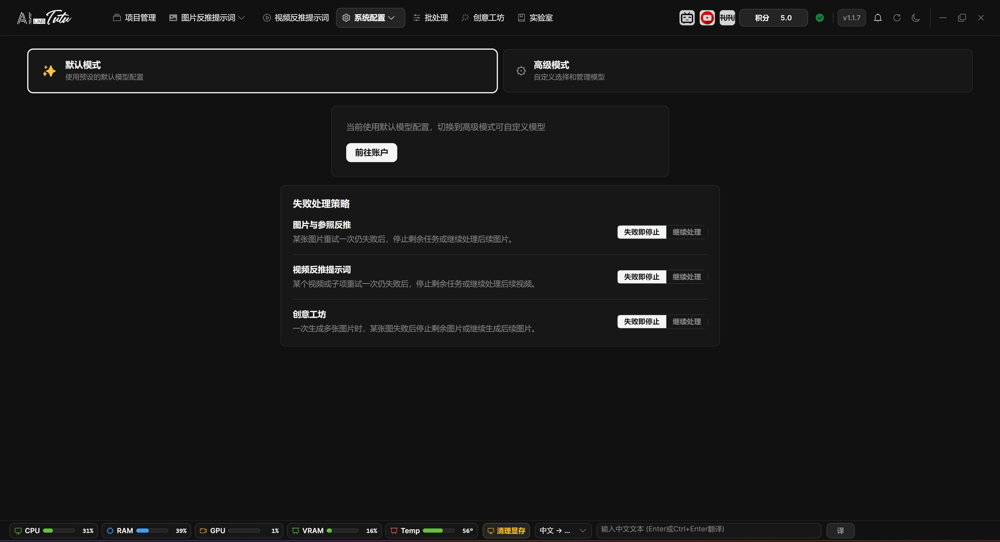
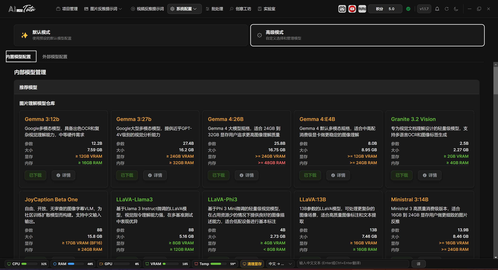
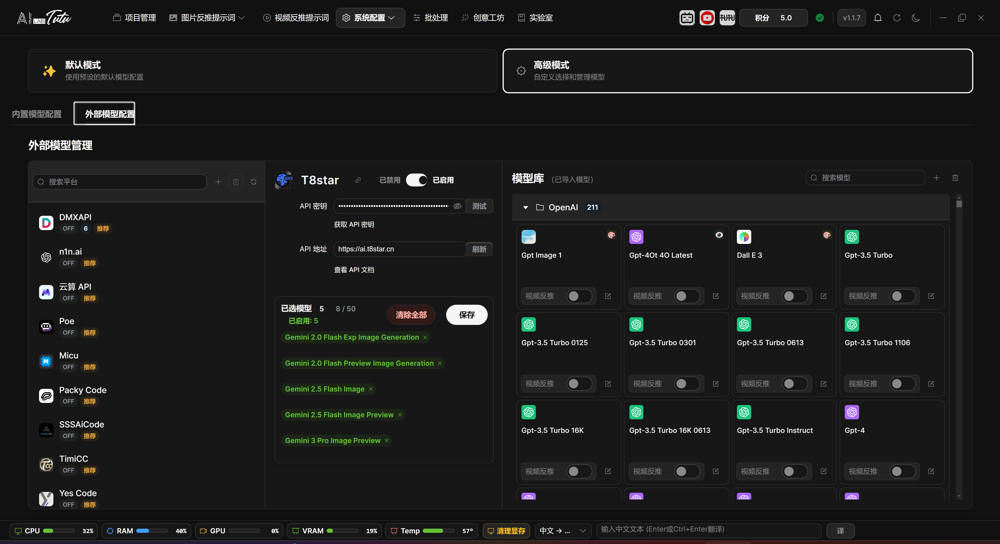

# Model Settings

## Page Location

Open the System Configuration drop-down menu in the top navigation bar and choose Model Settings.

Model Settings first separates Default Mode and Advanced Mode. For first-time use, keep Default Mode, confirm that account credits and default AI work correctly, and switch to Advanced Mode only when needed.

## Default Mode

Default Mode uses preset default AI configuration. Users only need to log in and buy credits to use image reverse prompts, natural-language descriptions, reference reverse captioning, video understanding, Creative Workshop, and related features.

### Default Mode Scope and Account Entry

Default Mode uses the unified account and credit system. You do not need to enter an API key or configure local model paths. Image reverse prompts, natural-language descriptions, reference reverse captioning, video understanding, and Creative Workshop use the app's preset default AI capability.

The Default Mode page displays an account entry, making it convenient to view balance, top up credits, and confirm subscription or device benefits.

### Failure Handling Strategy

The default strategy is conservative: when a task fails, processing stops first to avoid continuing a batch task and consuming more credits. When processing many materials, you can choose Continue Processing so that the app skips failed items and continues with later images, videos, or generation tasks.

Failure handling is divided into three categories: image and reference reverse captioning, video reverse prompts, and Creative Workshop. Each category can use Stop on Failure or Continue Processing. If one image, video, or generation subtask still fails after one retry, the app follows this strategy to decide whether to continue.

Default Mode model configuration. Regular users can keep Default Mode to use credits and default AI.

## Advanced Mode

Before switching to Advanced Mode, the app displays a confirmation prompt. Advanced Mode is for users who need their own API keys, local models, custom providers, or special model routing.

Advanced Mode mainly has two tabs: Built-in Model Configuration and External Model Configuration. The separate Video Model Configuration page mentioned in older documents is no longer an independent navigation entry. Video reverse-captioning capability is now managed through unified model and provider configuration.

## Built-in Model Configuration

Built-in Model Configuration manages local or built-in models, such as Ollama-related models.

You can view model lists, manage paths and status, test connections, enable or disable models, and perform related operations.

Local models depend on hardware performance, especially VRAM and disk space. If a model cannot load, first check the model path, Ollama status, VRAM, and log prompts.

### Recommended Models, Downloads, and Local Video Models

The top area of Built-in Model Configuration is Recommended Models. Cards show parameter scale, model size, VRAM and memory requirements, and use green, yellow, or red status hints to indicate how well the current hardware fits. Models that are not downloaded can be downloaded directly. Models that are already downloaded or manually prepared can have their paths configured.

Local video-understanding models are also managed here. Each model shows input modality, whether it natively supports video, model path, device, configuration status, test status, and enabled state. After setting the path, click Test first. Use the model for video reverse prompts only after the test passes.

Downloading models shows speed, downloaded size, remaining size, estimated remaining time, and elapsed time. Downloads can be paused or continued. The model is not truly deployed until the page's validation, configuration, and cleanup stages all complete.

### Model List, Connection Status, and Quantization

The local model list combines tested video models, Ollama models, external-path models, and quantized models. The action area on the right can delete, reconfigure, or remove paths. Removing a local video model path does not delete the original model files.

The bottom connection status is used to test whether the model service is available. In the model quantization area, choose an existing model and quantization type, then start quantization. Progress is displayed after startup. Completed quantized models enter the quantized-model list, where type, size, and creation time can be viewed.

Built-in Model Configuration. Manage local or built-in model status, paths, and downloads.

## External Model Configuration

External Model Configuration manages third-party providers, custom providers, API keys, model libraries, and connection tests.

Provider icons and sorting have been reorganized so provider sources are easier to recognize. Custom providers are also placed before system providers, making newly added interfaces easier to find.

Models can be selected and enabled by purpose. If a model should be used for video reverse prompts, turn on the Video Reverse Prompt switch on the model card and confirm that the model itself supports video or multimodal understanding.

When an external model reports an error, the page tries to show shorter and clearer reasons, such as invalid key, insufficient quota, unavailable model, too frequent requests, or temporary service unavailability.

### Provider List and API Configuration

The left side of External Model Configuration is the provider list. You can search platforms, add a custom provider, delete a custom provider, or refresh all models. Built-in system providers cannot be deleted casually. The switch area shows ON or OFF state and model count.

After selecting a provider, the middle area is used to enter the API key and API address. Click Test to verify connection. Before enabling a provider, at least one model must be selected, and both API address and key must be complete. Official website, key acquisition, and API documentation entries are also centralized here.

### Model Library, Selected Models, and Video Reverse Switch

The model library on the right supports searching by name and browsing by group. Click a model card to select or unselect it. Selected models appear in the selected-model panel in the middle, where they can be removed individually, cleared all at once, or saved.

Selected models are counted across providers, with a total limit of 50. When switching providers, the page synchronizes the model selections already saved for that provider. When disabling a provider, selected models under that provider are removed from the global selected set.

Capability icons on model cards identify visual understanding, image generation, and image editing capabilities. The Video Reverse Prompt switch only controls whether that model appears in the selectable range for video reverse prompts. Before enabling it, still confirm that both the provider API and model support the corresponding input.

External Model Configuration. Advanced users can manage providers, API keys, and the model library.

