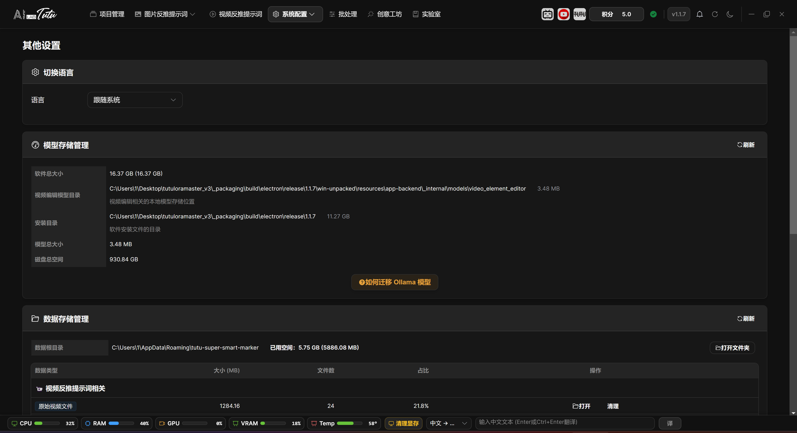
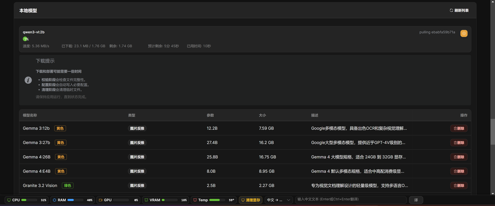
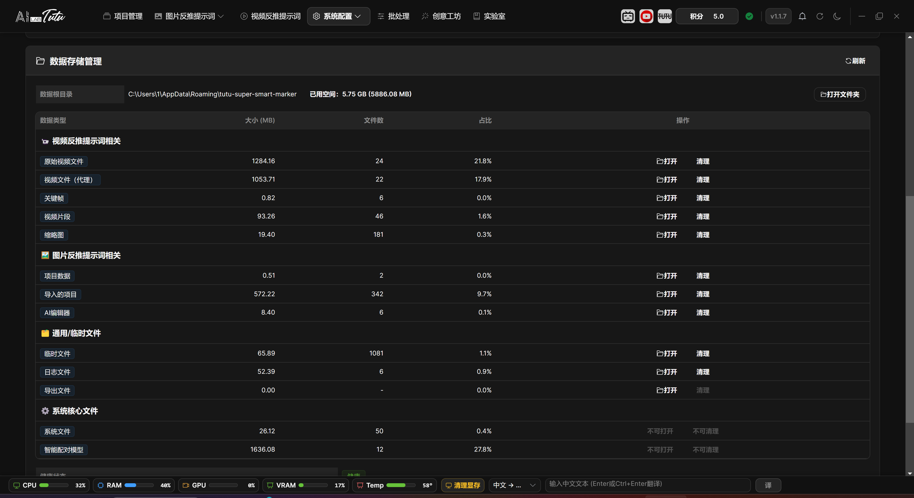

# Other Settings

## Page Location

Open the System Configuration drop-down menu in the top navigation bar and choose Other Settings.

Other Settings mainly handles language, model storage, data storage, cleanup, and disk health checks. Theme switching is handled in the top bar. The bottom translation assistant uses the unified translation service and usually does not need separate third-party key configuration here.

## Language and Theme

Language supports Follow System, Chinese, and English. On first launch, the app chooses automatically according to system language. Later, you can manually lock the language.

Theme supports Follow System, Light, and Dark. The top theme button can switch among these states.

The login page, settings pages, model selection, preset styles, and dialogs have been adapted to dark mode. If display looks abnormal, switch the theme once or restart the app.

### Language Switching

The language card provides Chinese, English, and Follow System options. After switching, the setting is written locally and the current interface language refreshes immediately. If Follow System is selected, the app resolves the system language into Chinese or English.

### Theme Switch Location

Other Settings no longer contains a separate theme selection card. Light, Dark, and Follow System switching is mainly handled by the theme button in the top bar. The setting is saved locally and remains effective after restart.

Other Settings. Language, theme behavior, model storage, and data paths are configured here.

## Translation Service

The translation service is used by the bottom translation assistant, tag translation, sentence translation, and other Chinese-English translation scenarios.

The current translation channel has been unified as the built-in translation service. Users usually do not need to enter Baidu, Tencent, or other third-party keys. If older instructions mention manual translation API configuration, follow the current interface instead.

### Bottom Translation Assistant

The translation assistant in the bottom status bar is available by default and supports Chinese-to-English and English-to-Chinese translation. Enter text and click Translate, or press Enter, Ctrl+Enter, or Command+Enter in the input box to trigger translation. The result area supports copy and clear.

### Tag and Sentence Translation

Internal functions such as tag translation and sentence translation use the same unified translation service. If translation fails, the page indicates error types such as rate limit, authentication failure, or temporary service unavailability. Regular users usually only need to retry later.

## Model Storage Management

Model Storage Management shows the built-in model directory, external model directory, video editing model directory, installation directory, and model disk usage.

For Ollama model migration, follow the operation guide shown on the page: confirm the model directory and disk space, stop Ollama, copy model files, choose the new location in Ollama settings, restart Ollama, and return to the app to detect again.

Before migration, confirm that the target disk has enough space and avoid moving model files while they are in use.

### Storage Paths and Capacity Information

Model Storage Management reads disk usage and displays the external model root directory and each model path, video editing model directory, installation directory, total model usage, and total disk space. The open button beside a directory opens the corresponding folder directly so you can check whether files exist.

### Ollama Moving Instructions

The How to Move Ollama entry opens the full operation guide. Before migration, do not move model files that are currently in use. After migration, choose the new directory in Ollama's own settings, fully exit Ollama, and start it again.

Model Storage Management. View external model directory, video editing model directory, installation directory, total model usage, and disk space. Specific model download, pause, and test operations are handled in Built-in Model Configuration.

## Data Storage Management

Data Storage Management shows the data root directory and usage for different data categories, including videos, video source files, thumbnails, keyframes, AI editor files, database, and logs.

You can open data folders to inspect actual files, or use smart cleanup to remove temporary files or old logs.

Before cleanup, confirm that the corresponding files are no longer needed. Project data, source materials, and databases should not be manually deleted casually.

### Data Categories and Open Folder

Data Storage Management displays usage grouped by videos, images, temporary data, and system data. Common types include original videos, proxy videos, thumbnails, keyframes, clips, AI editor files, exports, logs, and temporary files. Most rows can open the corresponding folder.

### Cleanup Rules and Safety Mechanism

When clicking cleanup, the app first provides default retention days and also allows custom days. Original videos, project data, imported projects, and AI editor files are important data and have stronger reminders before cleanup. Cleanup moves files to the system recycle bin instead of deleting them permanently.

System files and smart-pairing models are runtime dependencies. The page disables open or cleanup operations for them, and manual deletion is not recommended.

Data Storage Management. View disk usage for videos, thumbnails, keyframes, database, logs, and related data.

## Disk Health Check

Disk Health Check displays remaining space, health status, issue prompts, and optimization suggestions.

If import, generation, model download, or export fails, check disk space and read/write permissions first.

### Health State and Suggestions

The health check shows `healthy`, `warning`, or `critical` status, and lists remaining disk space, usage ratio, issue prompts, and optimization suggestions. When import, generation, model download, or export fails, first check the space and permission prompts here.
