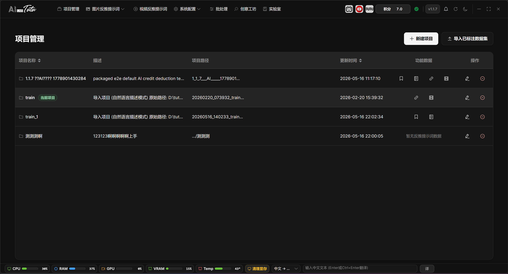
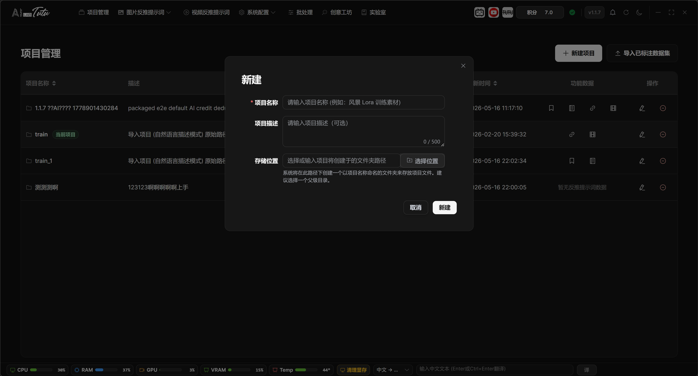
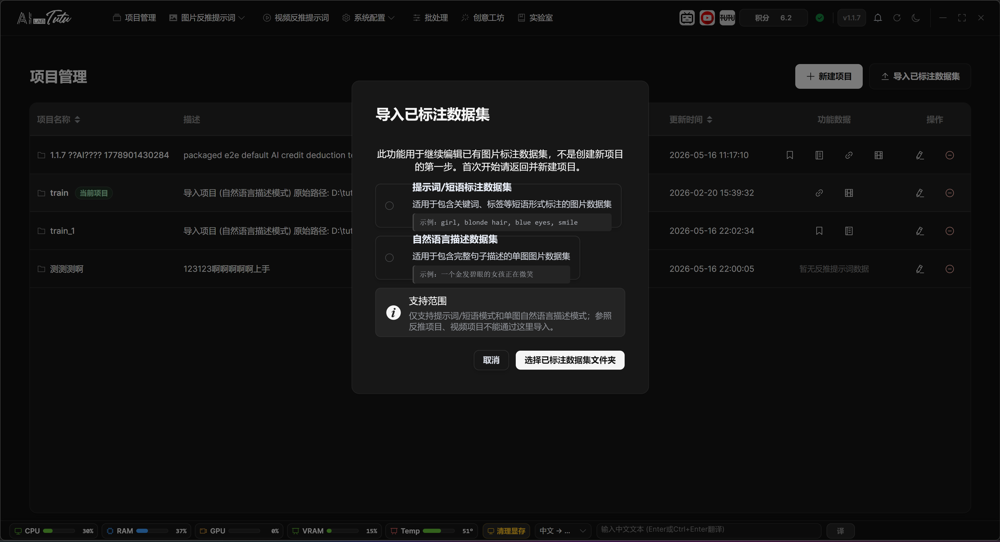

# Project Management

## Page Location and Purpose

Project Management is located in the top navigation bar. A project is the working container for images, videos, prompts, natural-language descriptions, reference reverse-caption data, and exported content.

After login, if you do not have a project yet, click New Project first. Use Import Labeled Dataset only when you already have an existing prompt or natural-language caption dataset and want to continue editing it.

## Project List

The project list shows the project name, description, project path, update time, feature data, and action buttons.

Click a row to set that project as the current project. The current project is highlighted and marked as Current Project.

The feature-data area shows whether the project already contains prompt tags, description labels, reference reverse-caption data, video reverse-prompt data, or video scene data. Click a corresponding marker to jump to the related feature page.

Project list. The current project, project path, feature data, and action buttons are shown together on the Project Management page.

### Feature Data Markers

The feature-data column is not a quantity counter. It is a quick way to check whether the project already has a certain kind of data. It checks prompt tags, natural-language descriptions, reference reverse-caption images and descriptions, videos, and detected scenes.

When data exists, the corresponding icon is displayed. Click the tag icon to enter Prompt Phrase Mode, the description icon to enter Natural Language Mode, the link icon to enter Reference Reverse Captioning, or the video icon to enter the Video Prompt Reverse Captioning page.

If the page says that no reverse-prompt data exists, the project currently has no jumpable image, description, reference reverse-caption, or video data. Enter the related feature page first to import materials or start generation.

## Create a New Project

1. Click New Project in the upper-right corner.

2. Enter a project name. The name should reflect the material topic or training purpose.

3. The description is optional. Use it to record the material source, dataset purpose, processing requirements, or notes.

4. You can manually choose the storage location. If left empty, the backend uses the default project directory.

5. After creation, return to the project list and click the project to make it the current project.

New Project dialog. Fill in the name, description, and storage location to create the project.

## Import a Labeled Dataset

Import Labeled Dataset is only for continuing to edit existing data. It is not required for first-time use.

During import, choose the dataset type first: prompt or phrase caption dataset, or natural-language description dataset.

After choosing the type, select the existing dataset folder. The app displays import progress and organizes the data into the app's own data system.

If you are starting from scratch with image reverse prompts, natural-language descriptions, or video organization, create a project first and then go directly to the related feature page.

Import Labeled Dataset. Use it only when you want to continue editing an old dataset. First-time users usually do not need it.

### Save Location and Progress After Import

The import button is available only in the desktop version. Choose the import mode first, then select the existing dataset folder. The import flow shows progress for scanning, analysis, record creation, image and tag import, and final setup.

To avoid accidentally modifying the user's original data, the app first copies the selected folder to the `imported_projects` folder under the app data directory, then imports from that copy. The copied folder includes a timestamp. The project name uses the original folder name by default. If another project already has the same name, the app automatically appends a number.

Prompt or phrase mode imports same-name `.txt` content as tags or keywords. Natural-language description mode imports same-name `.txt` content as description sentences. If import fails, the app reports whether the path does not exist, permissions are insufficient, the file system failed, or another specific error occurred.

## Edit and Delete Projects

The right side of the project list provides edit and delete buttons.

Edit is mainly used to change the project name and description. The project path is not changed casually in edit mode, which prevents existing material references from breaking.

Deleting a project is a high-risk operation. Before deleting, confirm that you have exported or backed up the data you need to keep.

### Editing, Deletion, and Data Retention

Click the edit button on the right side of a project to modify its name and description. The project path cannot be modified in edit mode, so that imported images, videos, and thumbnails do not lose their references.

The delete button opens a confirmation dialog first. After confirmation, the app removes the project from the project list and database records, and clears the app's internal records for related images, tags, sentences, and folders.

Deleting a project does not actively delete the project folder on disk. The original files remain in the project path. Even so, the project record is no longer visible inside the app after deletion, so confirm export or backup before deleting.

## Project Selection Rules

Image Prompt Reverse Captioning, Prompt Phrase Mode, Natural Language Mode, Reference Reverse Captioning, Video Prompt Reverse Captioning, and related pages all depend on the current project.

If a page says Please select a project first, return to Project Management and click the project row.

Image and video entries in the top navigation show a reminder when no project is selected, which prevents materials from being imported into the wrong project.

### Project Selection and Entry Jumps

Clicking any row in the project list only sets that project as the current project. It does not automatically jump to an image or video page. After selection succeeds, the row is highlighted and marked as Current Project.

When you later enter image reverse captioning, natural-language mode, reference reverse captioning, video reverse prompts, or batch processing, the app uses the current project by default. If the page says Please select a project first, return to Project Management and click the correct project row.
