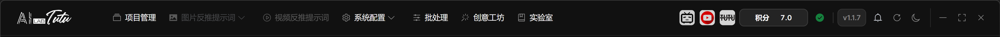
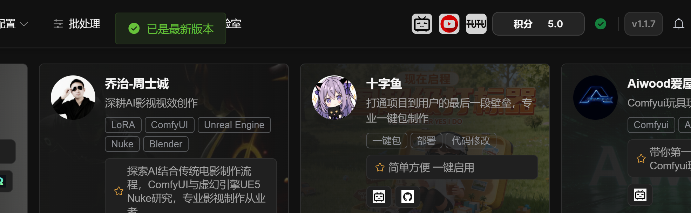
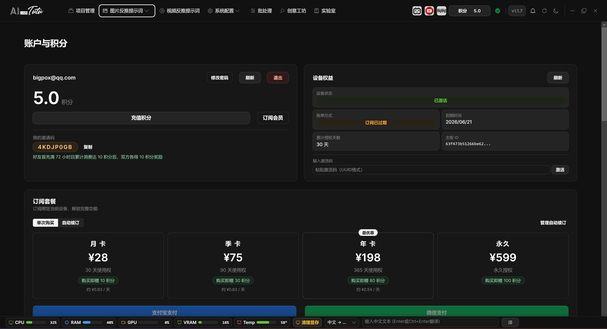

# Top Bar, Status Bar, and Account Entry

## Top Bar Entries

The right side of the top bar shows credits, device or authorization status, current version, check updates, refresh data, theme switching, and more actions.

The credit display is synchronized with the account page. After credits or transaction history are refreshed on the account page, the top credit display updates as well.

Check Updates now immediately shows checking or failure feedback. It no longer stays silent like older versions.

Top navigation bar. Project Management, Image Prompt Reverse Captioning, Video Prompt Reverse Captioning, System Configuration, Batch Processing, Creative Workshop, and Lab are entered from the top navigation.

Top bar update-check feedback. After clicking Check Updates, the app directly displays the current version state.

## Bottom Status Bar and Translation Assistant

The bottom status bar is displayed globally outside the login page. It is located at the bottom of the app. It does not replace the current page toolbar. It is used to observe resource usage, clear VRAM, and perform quick translation at any time.

### Resource Monitoring and VRAM Cleanup

Resource monitoring displays CPU, RAM, GPU, VRAM, and Temp from left to right. Progress bars and percentages help judge current machine load. If no GPU is detected, or if the graphics card does not return temperature data, the corresponding item is not shown.

The status bar refreshes about every 2 seconds by default. Hover over a monitoring item to view more details such as system, graphics card name, and VRAM usage. When running video enhancement, element removal, local models, or large batch tasks, watch GPU, VRAM, and Temp first.

Click Clear VRAM to call the GPU memory cleanup interface. It is useful after local-model, video enhancement, element removal, or similar tasks finish. Use it after the task ends. Do not force cleanup during a running task just to lower visible usage. While cleanup runs, the button shows a loading state, and completion or failure shows a prompt.

### Quick Translation and Narrow-Window Display

The translation assistant is on the right side of the bottom bar. It provides Chinese to English and English to Chinese by default. Enter text and click Translate, or press Enter, Ctrl+Enter, or Command+Enter to trigger translation.

The translation result appears directly to the right of the input box. Click the copy button to copy the result, or the clear button to clear it. When switching translation direction, the input and result are cleared automatically to avoid mistaking the previous result for the current one.

If the window is narrow, the input placeholder is shortened. When the window is even narrower, the result area collapses first so the bottom bar does not block the main page workflow. The login page does not show the bottom bar to avoid interfering with login.

## Account and Credits Entry

Account and Credits can be opened from the top credit display, the authorization icon, or the System Configuration drop-down menu.

The account page centralizes email, credits, invitation code, device benefits, subscription plans, credit packages, credit consumption rules, and transaction history.

Credit packages are account benefits. Log in with the same account to view balance and transaction history. Subscription plans and device authorization are bound to the current device.

Account and Credits entry. The account page centralizes credits, device benefits, subscription plans, and credit packages.

## Transaction History

Transaction history is based on server records. It can be pulled for the last 3 months, last 6 months, last 1 year, or all records.

Transaction history does not need local cleanup. Use refresh and range selection to reconcile online records according to the server.

## Appendix: Common Operations and Shortcuts

Video list page:

* Ctrl+A: select all.
* Ctrl+C: copy selected videos.
* Ctrl+V: paste videos.
* Delete: delete selected videos.
* Ctrl+R or F5: refresh.
* Esc or Ctrl+D: cancel selection.

Video detail page:

* Space: play or pause.
* Left and right arrow keys: rewind or advance.
* Up and down arrow keys: adjust volume.
* M: mute or unmute.
* F: enter or exit full screen.

For image pages and batch processing pages, follow the interface buttons. Before batch operations, confirm the current project, current filters, and current selection range.

## Version Information

Version: see the document title or app version displayed in the top bar.

Last updated: May 28, 2026.

Author: Zhaotutu.

***

## Changelog

### Current Version

This update focuses on turning the app into a complete, stable, long-term workstation. Login, account benefits, credits, default AI, video batch processing, model downloads, dark mode, language settings, installation, and update flows have all been substantially adjusted.

New and rebuilt:

* Account login and account center are online. Email registration and login are supported. The account page centralizes credits, subscriptions, device benefits, activation status, invitation code, and transaction history.
* Default AI workflow has been improved. Image reverse prompts, natural-language descriptions, reference reverse captioning, and video understanding can use default AI directly. Regular users do not need to configure models first.
* Transaction history supports online pulling. The account page can synchronize server records for the last 3 months, 6 months, 1 year, or all records, which helps cross-device reconciliation.
* Multi-content video reverse captioning can merge analysis. When the same video generates scene description, summary, and spoken script at the same time, the default AI gateway tries to merge them into one video-understanding request.
* Video batch reverse-captioning workspace now supports batch generation of scene descriptions, summaries, and spoken scripts for multiple videos, then automatically focuses on the result content.
* Online video import has been enhanced. The video page now has Link Online Video, where pasted links or shared text are automatically recognized.
* Video batch export entry can export overall content for multiple videos. The video detail page still handles more complete material package export.
* Element editing supports a manual box-selection approach for regular rectangular targets such as watermarks, subtitles, and fixed regions.
* Model downloads now use task-style downloads, showing speed, downloaded size, remaining time, and elapsed time. Cancel and status refresh are more reliable.
* Language supports Follow System. Theme supports Follow System, Light, and Dark.

Experience and stability:

* Login page, top action bar, account page, project management, image library, reference reverse captioning, video list, model configuration, and dark mode have received extensive visual and wording cleanup.
* Top credit display synchronizes with the account page. Check Updates immediately displays checking state or failure prompts.
* Default Mode no longer exposes underlying model names, reducing confusion for new users.
* Image-list and batch-operation range prompts are clearer, reducing accidental operations.
* Creative Workshop generation progress is more detailed. If only part of a request succeeds, successful images remain and the failure count is shown.
* External model error messages are shorter and clearer. Provider icons and sorting have also been reorganized.

Fixes:

* Fixed unstable authorization recognition for users who purchased older versions after login.
* Fixed missing local transaction history after successful default AI credit charge.
* Fixed inconsistent credit charge and transaction state when default AI failed.
* Fixed repeated credit charges when the same video generated multiple content types.
* Fixed cases where incomplete multi-content video results could still be charged.
* Fixed unclear transaction-history cleanup and refresh semantics.
* Fixed large-model download UI freezes, incomplete cancellation, and progress jumps.
* Fixed similar-image empty results, invalid thumbnail requests after deletion, and inaccurate tag-filter ranges.
* Fixed video element box selection being forced through automatic recognition only.

Installation and updates:

* Update distribution has moved to a newer stable download channel. Version number, update notes, installer, update package, and official download entry flow have been centralized.

### Version 1.1.6

Feature improvements:

* Large image auto-resizing: added image preprocessing to fix AI captioning failures caused by oversized images. When total pixels exceed 1536 x 1536, about 2.36 million pixels, the system automatically scales the image proportionally before captioning. This happens transparently in the background and does not affect the original image.
* Smart Generate Description: single-image natural-language captioning now preprocesses images automatically.
* Smart Generate Prompts: prompt-phrase captioning now preprocesses images automatically.
* AI-generated paired descriptions: both paired images are preprocessed automatically.
* Proportional scaling strictly preserves original aspect ratio and uses integer width and height after resizing.
* Temporary file management: resized images use temporary files and are cleaned up automatically after processing.
* Smart Generate configuration is remembered automatically. When users reopen related pages, the last-used configuration is restored.
* Smart Generate Description saves and restores model selection, language, focus target, filter strength, and related settings.
* Smart Generate Prompts uses the same persistence behavior.
* AI-generated paired descriptions save independent configuration and do not affect single-image captioning.
* Smart Generate Description and Smart Generate Prompts dialogs were redesigned to lower the usage barrier.
* Visual mode selection replaces the old focus-target drop-down with clickable cards. Each option has an icon, description, and usage hint.
* Preset modes include Default, Portrait or Face, Clothing, Person, Style, Other Elements, and Custom Prompt.
* The dialog is reorganized into three clear areas: 1 Select Main Model, 2 Select Generation Mode, and 3 Output Settings.
* LoRA training help was added to the generation-mode area through a help icon that explains LoRA training principles and captioning usage.
* Batch processing small-image optimization: in Resize or Format, Skip Upscaling is enabled by default so small images are not enlarged and only format conversion occurs.
* Splash screen no longer forces always-on-top. Users can switch to other windows while the app starts.
* Image thumbnail quality has been improved for easier face-training material selection.
* Thumbnail size increased from 256 x 256 to 384 x 384.
* Compression quality increased from 85 to 92.
* WEBP now uses the highest quality compression method.
* This applies only to newly imported images. Existing images need to be re-imported.

Bug fixes:

* Fixed imported image file names receiving random hash suffixes during batch processing.
* Fixed processed images in Resize or Format receiving random suffixes.
* Fixed flipped display in some viewers after processing photos that contain EXIF Orientation tags.
* Improved trial status query to fix cases where clicking Trial immediately showed that the trial had ended.
* Fixed occasional startup stuck at 100% due to proxy environment variable compatibility.
* Fixed small gaps between page bottom pagination components and the window bottom, and fixed the bottom pagination status bar on single-image natural-language captioning.
* Added global filtering for deprecated model ID `gemini-2.5-flash-image-preview(nano-banana)`, keeping the correct `gemini-2.5-flash-image-preview`.
* Fixed Element Plus type compatibility to improve custom model stability.

### Version 1.1.5

New features:

* Activation system expanded with quarterly and monthly authorization options, giving users more flexible authorization choices. The activation dialog now correctly displays authorization type and expiration time.
* Editing timeline real-time preview: when dragging the timeline playhead, the video follows in real time without waiting for dragging to end.
* Video card double-click opens detail page directly in the video captioning page.
* Tencent Cloud Translation extension scenarios were added to Other Settings. Users can apply Tencent Cloud Translation API to prompt-phrase captioning and single-image natural-language captioning translation. Tencent Cloud Translation provides a monthly free character quota suitable for daily use.

Improvements:

* Element editor button layout was improved. Clear All and Start Tracking moved from floating placement into normal content flow below Keyframe Management.
* Video player interface was simplified by removing the large center play button when paused.
* Video player control bar improved: volume icon changed from microphone to speaker, playback/volume/fullscreen buttons are larger, and custom SVG icons avoid the double-circle play-button issue.
* Sentence edit box width now adapts in single-image natural-language captioning, making long sentences easier to edit.
* System configuration subpages now have clear page titles for internal model configuration, external model configuration, and other settings.
* External model configuration layout now uses a unified outer border container around its three-column layout.
* T8star default model ID changed from `gemini-2.5-flash-image-preview(nano-banana)` to `gemini-2.5-flash-image-preview`.
* Batch processing task details were simplified. Task ID is now shown as a description-table row.
* Batch task list columns now adapt to available width.
* Batch processing log area height increased from 200 px to 350 px.

Bug fixes:

* Fixed an element editor watermark-removal crash that could happen when the final segment's actual frame count was smaller than overlap frame count.
* Fixed video-list thumbnails not updating after saving results from element editing or AI video enhancement.

### Version 1.1.4

Bug fixes:

* Fixed first-install trial showing that the device had already been activated.
* Fixed exported prompt-phrase tag order not matching the frontend display order.
* Fixed numeric file-name sorting in image library and video list.
* Fixed video thumbnails and playback failing when video file names contained URL special characters such as `#`, `?`, or `&`.
* Fixed `UNIQUE constraint failed: videos.id` when uploading videos in multi-project environments.
* Fixed element editor watermark removal reporting mask count and frame count mismatch.
* Fixed uploaded video names being incorrectly prefixed with `upload_projectID_`.
* Fixed database locked errors when batch-marking images as duplicate.

New features:

* Added Recheck Activation Status in the forced activation page. Already activated users can revalidate after network recovery without re-entering activation code.
* Duplicate video names in one project now receive automatic numbering, such as `video.mp4`, `video (2).mp4`, `video (3).mp4`.
* Image library supports drag-and-drop import from Windows Explorer or desktop for prompt-phrase and single-image natural-language pages.
* Reference natural-language captioning supports drag-and-drop import in unpaired single image, unpaired source image, and unpaired result image areas.
* Video captioning supports drag-and-drop import of local video files, including batch drag-and-drop.

Other changes:

* AI video enhancement button is temporarily hidden from the video captioning toolbar until the effect is optimized.
* Dynamic light effect in the title bar was removed to simplify visual design.

### Version 1.1.3

* Added three core video-processing modules.
* Improved video export with GPU acceleration and full-screen progress dialog.
* Completed storage management system.
* Added smart database migration mechanism.

### Version 1.1.2

* Added video captioning page.
* Added activation-code system.
* Added video model configuration management.
* Added YouTube video analysis.

### Version 1.1.1

* Fixed startup permission issues.
* Improved image import speed.
* Improved file storage architecture.

### Version 1.1.0

* Added paired-image captioning.
* Added Creative Workshop.
* Added AI Lab.
* Greatly expanded the external model ecosystem.

## Technical Support

For questions or suggestions, contact:

* QQ: `331506796`
* WeChat: `tujiang0411`
* Official purchase and download site: https://zhaotutu.xyz

Feedback is welcome if you run into any issue.
