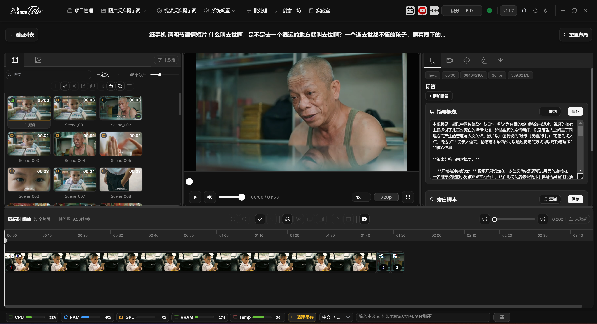

# Video Detail Page

## How to Enter

In the video list, select a local video and click Edit, or double-click the video card to enter the video detail page.

The video detail page is used for more detailed work on one local video, including scene detection, timeline organization, AI content generation, subtitle and spoken-script editing, and material package export.

### Video Detail Page Layout and Splitters

The video detail page is a two-row, three-column editing workspace. In the upper area, from left to right, it contains the clip and keyframe panel, video player, and right-side function panel. The lower area is the editing timeline.

The left splitter adjusts the width of the clip panel and player. The center splitter adjusts the width of the player and right-side function panel. The horizontal splitter adjusts the height of the upper workspace and bottom timeline.

The layout has boundary limits. The left clip panel cannot be smaller than about 15%, the player cannot be smaller than about 25%, and the upper area height is limited to about 40% to 80%. Click Reset Layout at the top to restore the default layout: left 30%, center 40%, upper area 60%.

The right-side function panel can be understood as five entries: basic information, automatic clipping, AI processing, content editing, and package export. The icon labels are compact, and hovering shows their names.

## Scene Detection and Timeline

Scene detection splits the video into scene clips according to shots or visual changes and generates keyframes.

You can view scenes, keyframes, and AI content status in the clip list, and you can add clips to the timeline for organization.

The timeline supports playback preview, clip order adjustment, trimming, splitting, merging, and related export operations.

Video detail page. Video, clip timeline, keyframes, and AI content are organized on one page.

### Clip List Selection and File Operations

The Clip List in the left clip panel contains the full video entry and clips generated by detection or editing. At the top, you can search, sort, view counts, and adjust card size with the thumbnail slider.

Clip cards show AI content badges in the upper-left corner, duration in the upper-right corner, and a checkmark in the lower-right corner when the clip has already been added to the timeline. Newly generated clips are briefly highlighted and marked NEW.

Click a clip to select it and switch the playback target. In single-selection state, click the same clip again to cancel selection and return to the main video. Ctrl or Command-click supports multi-selection. Shift-click selects a continuous range. Drag over empty space to box-select.

Double-click a clip to add it directly to the bottom timeline. The plus button in the toolbar adds the currently selected clips to the timeline in batch. The full video can be selected for playback or AI processing, but it cannot be deleted, renamed, or copied as a normal clip file.

The clip toolbar also supports select all, cancel selection, rename, copy, paste, open clip folder, refresh, and delete. Rename supports a single rename, and batch rename by sequence number, prefix, or suffix.

### Keyframe List Selection and File Operations

The keyframe list is used to view keyframes from video detection or refresh. At the top, you can search, sort by name or time, and adjust keyframe thumbnail size.

Click a keyframe to toggle selection. Shift-click selects a continuous range. Drag over empty space to box-select. Double-click a keyframe image to jump the player to that keyframe time. Click the time label to rename the keyframe file.

The keyframe toolbar supports select all, cancel selection, single or batch rename, copy files, paste copied keyframes, open keyframe folder, refresh, and delete. Deleting keyframes runs according to the currently selected keyframe paths.

### Basic Editing Timeline Operations

The bottom timeline reorganizes clips into an editing sequence. Add clips by double-clicking the clip list or clicking the plus button. After being added, clips are arranged in order on the timeline and display an Added marker in the clip list.

The timeline supports click selection, Ctrl to add selection, Shift for continuous selection, box selection over empty space, drag sorting, and auto-scroll near the edge. The toolbar can select all, cancel selection, copy, paste, and delete selected timeline clips.

The playhead can be dragged on the ruler or track, or moved by clicking the track. Timeline zoom ranges from about 0.02x to 4x. Use the zoom slider on the right, zoom buttons, or Ctrl + mouse wheel.

Split runs when the playhead is inside a clip and cuts that clip into left and right parts. Merge requires selected clips to be continuous on the timeline. Merged clips preserve subclip information. When they are later exported back to the clip list, the app regenerates video according to the subclips.

Export to Clip List creates the selected timeline clips back into the left clip list. Small numbers of clips are processed directly. More clips, longer total duration, or merged clips enter a background task with progress. Duplicate clip names automatically get appended numbers to avoid overwriting.

Built-in timeline shortcuts:

- Ctrl+Z and Ctrl+Y: undo and redo.
- Ctrl+A: select all.
- Esc: cancel selection.
- Ctrl+C, Ctrl+X, Ctrl+V: copy, cut, paste.
- Delete: delete.
- Ctrl+S: split.
- Ctrl+M: merge.
- Ctrl+E: export.
- Space: play or pause.
- Left and right arrow keys: move the playhead.

## AI Content Generation

The video detail page can generate scene descriptions, summaries, and spoken scripts.

In default AI mode, users do not need to manually choose the underlying model. In advanced mode, you can choose an external model or local model through the video reverse-captioning model selector.

When multiple content types are generated for the same video at the same time, the app tries to reuse one video-understanding result and charges credits once according to the real amount returned by the server.

If returned content is missing, the API fails, or credits are insufficient, the client treats the task as failed and should not write a successful credit-charge record.

### AI Processing Range and Output Settings

The AI Processing entry on the right processes the object currently selected in the left clip panel. If the full video is selected, it processes the main video. If one or more clips are selected, it processes those clips. If no object is selected or no processing type is checked, the start button is unavailable.

Available processing types include summary, spoken script, and scene description. Summary can configure style, length, language, and included elements. Spoken script can configure style, pace, language, plain or SRT format, and interaction guidance. Scene description can configure style, detail level, language, and plain or SRT format.

In default AI mode, the page shows Default Mode and does not require manual model selection. In advanced mode, choose an external or local model in the video reverse-captioning model selector.

During a task, the page shows current stage, progress percentage, success and failure counts, current processing object, task type, model, and elapsed time. Streaming content display and cancellation are supported.

After completion, if only the full video was processed, the page returns to the Basic Information area. If clips were processed, the page switches to the Content Editing area so you can immediately check and modify clip results.

## Prompt Editor

Video scene description, summary, and spoken-script prompt configuration have independent editor entries.

It is recommended to run the workflow with default prompts first, then adjust prompts according to your material type.

### Main Video and Clip Content Editing

In Basic Information, you can edit the main video's summary, spoken script, and scene description. Each block has copy and save buttons. The save button becomes available only after the content changes.

Content Editing is used for one clip. The edit form appears only when exactly one normal clip is selected in the left clip list. If multiple clips are selected, no clip is selected, or only the full video is selected, the page shows a selection prompt.

Clip content editing is also divided into summary, spoken script, and scene description. Each block can be copied or saved. Saving updates only the current clip and does not automatically sync to other clips or to the main video.

If you need to rewrite content in batch, use AI Processing or batch processing first, then review important clips one by one. Do not expect the Content Editing area to batch-save in multi-selection state.

## Package Export

Package Export in the video detail page can organize the original video, clips, keyframes, subtitles, and AI-generated text.

During export, a stable progress summary is shown, including processing mode, overall count, clip count, and output directory.

Do not close the app during export. Do not move the source video or project directory.

### Package Export Content and Progress

Package Export is divided into whole-video content and clip content. Whole-video content can include the original video, summary, spoken script, and scene description. Clip content can include clip videos, keyframes, clip summaries, clip spoken scripts, and clip scene descriptions.

Spoken scripts and scene descriptions can be exported as `txt` or SRT. SRT is more suitable for subtitles and timeline scenarios. `txt` is better for regular text organization.

Before export, choose an output directory and confirm that the current clip list, keyframes, and AI text are ready. During export, the page shows total progress, export mode, overall count, clip count, current clip, current subclip, and output directory.

Do not close the app, move the source video, or move the project directory during export. When merged clips or many clips are included, the progress window may show subclip progress. This is normal.
