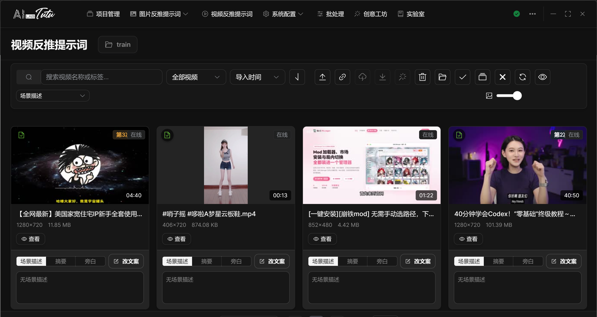
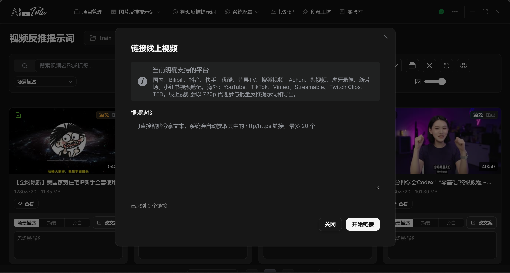
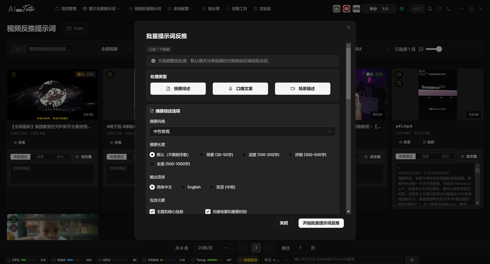
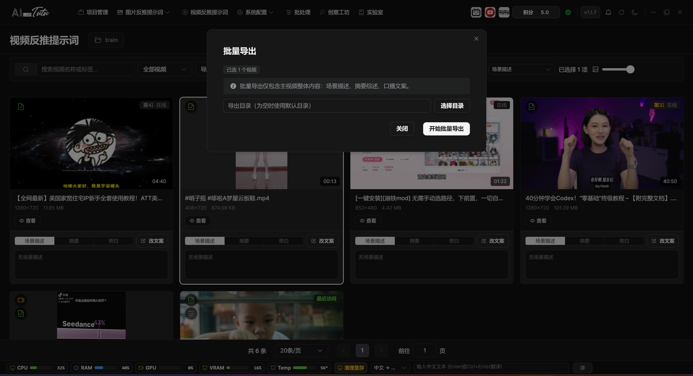
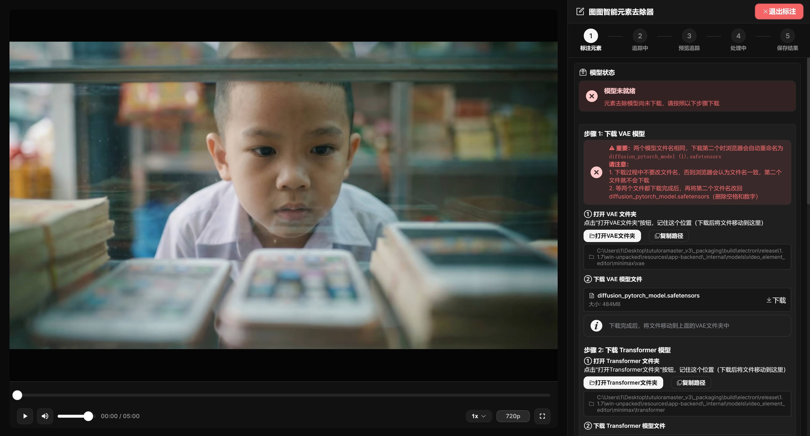

# Video Prompt Reverse Captioning

## Page Location and Project Requirement

Video Prompt Reverse Captioning is located in the top navigation bar. Select a project before entering this page, because local videos, online video records, scene descriptions, summaries, and spoken-script drafts all belong to a project.

If the page says that a project must be selected, return to Project Management, click the project row, and then enter the video page again.

## Video List and Toolbar

The video page supports local videos and online video records. The toolbar includes search, reverse-prompt status filtering, sorting, import local video, link online video, batch prompt reverse captioning, batch export, element editing, delete, open project folder, select current page, select all project videos, clear selection, refresh, preview toggle, and thumbnail-size adjustment.

Video cards show thumbnail, duration, file name, resolution, size, and status badges for scene description, summary, spoken script, timeline data, and related generated content.

For local videos, click View for read-only viewing, or click Edit to enter the video detail page. Double-clicking a local video card also opens the detail page.

Online videos are mainly read-only records. They are suitable for viewing generated scene descriptions, summaries, and spoken scripts.

Video Prompt Reverse Captioning list. Video cards show local or online source and generated-content status.

### Video List Selection and Preview Area

The video list uses selection behavior similar to the image grid. Click a video card to select only that video. Hold Ctrl or Command and click to add or remove one video from the selection. Hold Shift and click to select a continuous range from the previously clicked video to the current video.

Drag over empty space to box-select video cards or table rows. If Ctrl is not held during box selection, the previous selection is cleared first. Select Current Page selects only videos shown on the current page. Select All Project selects currently loaded videos. If the project total is greater than the loaded count, the page shows a quantity prompt.

The preview toggle on the right side of the toolbar displays AI content previews below the cards. Preview type can be switched between scene description, summary, and spoken script. You can also switch preview type on a single card. Double-click the preview area or click the edit button to open the content-editing dialog.

Use the delete button carefully. If no video is selected, the delete flow enters confirmation for deleting all videos. If videos are selected, only selected videos are deleted. Always check the quantity in the confirmation dialog before deleting.

### Video Card Status Badges and Entry Points

The upper-left corner of a video card shows AI content badges. The camera badge means scene descriptions exist. The document badge means a summary exists. The microphone badge means a spoken script exists. The timeline icon means timeline data exists. The duration marker on the right shows video length. Online videos also show an online-source label.

Local videos support View and Edit. View opens a read-only viewing window. Edit opens the video detail page. Double-clicking a local video card also opens the detail page directly. Online videos are mainly read-only and do not enter the local editing detail page.

A recent-access marker may appear at the top of a card to show that the video was opened recently. The thumbnail-size slider changes only the display size of grid cards. It does not change the video file itself.

## Import Local Videos

Click the import button in the toolbar to select local videos, or drag video files into the video page.

Common video formats are supported, including `mp4`, `webm`, `mov`, `avi`, `mkv`, `mpeg`, `3gp`, `flv`, and `wmv`.

During import, a full-screen progress dialog is displayed to avoid state confusion caused by switching pages. After import completes, the app shows the number of successful and failed files.

### Local Import Progress and Drag-and-Drop Import

Local video import can use the toolbar upload button or direct drag-and-drop into the video page. The page displays a drag overlay. When you release the files, import starts.

During import, a full-screen progress window is shown. Each file has a waiting, uploading, success, or failed state. Do not switch pages or close the app before import finishes. Close the progress window only after all files are complete.

After successful import, the list refreshes and shows thumbnails, duration, resolution, and file size. If import fails, first check file format, whether the file is locked by another program, path permissions, and disk space.

## Link Online Videos

Use Link Online Video as the recommended entry for online videos. Paste an online video link or shared text, and the system automatically recognizes the link inside it.

The separate YouTube analysis button mentioned in older documents is no longer the main entry. The current unified path is the Link Online Video function in the video page.

After an online video is added to the project, you can view video information and generated content in the read-only viewing window.

Link Online Video dialog. Paste a shared link and the system recognizes the online video source.

## Batch Prompt Reverse Captioning

Select one or more videos, then click Batch Prompt Reverse Captioning in the toolbar.

You can generate scene descriptions, summaries, and spoken scripts as needed. In default AI gateway mode, when multiple content types are generated for the same video at the same time, they are merged into one video-understanding request to avoid repeated upload, repeated analysis, and repeated credit charges.

After the batch task finishes, the detail and preview areas automatically focus on the corresponding result, which reduces the chance of mistaking a successful task for a failed one.

Batch Video Prompt Reverse Captioning settings. Generate scene descriptions, summaries, and spoken scripts as needed.

### Batch Reverse Range and Configuration

Batch Prompt Reverse Captioning processes only the currently selected videos. The top of the dialog shows the selected video count. If no video is selected, the toolbar button is unavailable.

Scene description, summary, and spoken script are selected by default. You can turn off any content type you do not need. In default AI mode, you do not need to choose a model. In advanced mode, choose an available video reverse-captioning model in the model selector first.

Batch reverse captioning uses the same configuration panels as the video detail page. Summary supports style, length, language, and included elements. Spoken script supports style, pace, language, output format, and interaction guidance. Scene description supports style, detail level, language, and plain or SRT output format. All three task types support custom prompts.

While a task is running, the dialog locks the close button and shows the current video, processing item, subtask progress, success and failure counts, elapsed time, and recent events. You can click Cancel Task. After the cancellation request is sent, wait for the backend to return status.

After completion, the result panel is displayed. If there are failures, the table lists the video, processing type, failure reason, and error code. If the failure is insufficient credits, follow the insufficient-credit flow and do not restart the same batch repeatedly.

## Batch Export

After selecting videos, click Batch Export to export overall content for multiple videos, such as scene descriptions, summaries, and spoken scripts.

If you need to export clips, keyframes, or a more complete material package, enter the video detail page and use Package Export.

During export, check output directory permissions, disk space, and file-name conflicts.

Video Batch Export dialog. Choose the export range and content to generate video materials.

### What Batch Export Actually Exports

Batch export from the video list exports overall content for multiple videos. The current export request includes overall scene description, overall summary, and overall spoken script. It does not include video clips, keyframes, or clip-level text.

If you need clips, keyframes, clip summaries, clip spoken scripts, or a complete material package, enter the detail page for a single video and use Export Package.

Batch export lets you choose an output directory. After the task starts, progress and WebSocket status show the current progress. After completion, the root directory of the batch export is displayed. Closing the dialog while the task is running opens a confirmation prompt first.

## Element Editing Entry

The Element Editing button is used for one selected local video. Only one video can be selected when entering element editing.

Element editing supports click, box, and brush annotation modes. It also supports automatic tracking and manual segments. It is useful for watermarks, subtitles, logos, fixed regions, regular rectangular areas, and similar targets.

This feature depends on local models and GPU. On first use, if the models are not ready, the page shows download instructions, placement paths, and verification buttons for the VAE, Transformer, and SAM2 models.

Element Editing page. It is used for video-screen elements such as watermarks, subtitles, and fixed regions.

### Entry Conditions and Five-Step Flow

In the video list, select exactly one local video before entering element removal. Online videos do not support this entry. After entering, the video player is on the left and the tool panel is on the right. The flow proceeds through five stages: 1 annotate element, 2 tracking, 3 preview tracking, 4 processing, and 5 save result.

During tracking and processing, the exit button is hidden to prevent accidental operation. Element removal clears the video's existing clips and keyframes. Saving the result also replaces the original video. Before processing, confirm that the original project material has been backed up or is no longer needed.

### Model Status, GPU, and Download Guidance

The right side first shows model status. When models are not ready, the page provides folder entries, copy-path buttons, download links, and verification buttons for VAE, Transformer, and SAM2. The two MiniMax model files have the same name. If the browser renames the second file to `diffusion_pytorch_model (1).safetensors`, rename it back to `diffusion_pytorch_model.safetensors` after download.

The annotation tools are enabled only after models are ready. Before preview processing, the page shows GPU name and available VRAM. The quality card provides fast, balanced, high-quality, and custom configurations. When VRAM is tight, choose fast or balanced first.

### Click, Box, and Brush Annotation

Click mode is suitable for elements with irregular shapes but clear targets. First add positive points on the element to remove, then add negative points on nearby areas that should not be removed. When you move to a new time point and continue annotation, old points are cleared automatically to avoid misaligned points across frames.

Box mode is suitable for watermarks, title subtitles, fixed corner labels, and other regular regions. Automatic box selection sends the rectangle to SAM2 for segmentation. After drawing the rectangle, you can drag it or adjust its edges. Manual box selection uses the rectangle directly as a mask and specifies a time range without calling AI tracking. The box must stay inside the video frame and cannot be drawn in black border areas.

Brush mode is suitable when you need to manually paint a more accurate mask. Automatic tracking uses the first-frame brush mask to track the entire video. Manual drawing saves the user-painted mask and time range directly. Brush size can be adjusted from 2 to 64 px.

### Keyframes, Manual Segments, and Tracking Preview

In automatic tracking mode, after generating the mask you can start tracking directly. If the target moves quickly, is occluded, or changes shape noticeably, annotate again at different time points and click Add Keyframe at Current Frame. Multi-keyframe tracking can improve stability.

In manual mode, draw the mask and click Confirm and Generate Mask. Then play or drag to the end time and click End and Save Segment. After saving multiple segments, click Generate Preview and the page generates a preview video according to the segment ranges.

After tracking finishes, the left side switches to the preview video. Check the whole preview to confirm whether the mask follows the target and whether it damages the background. If the result is unsatisfactory, click Re-annotate. If it is satisfactory, proceed to processing.

### Processing Quality, Cancellation, and Saving Results

After preview confirmation, choose processing quality. Fast saves time and VRAM. Balanced fits most videos. High quality is slower and uses more VRAM. Custom lets you adjust inference steps and iteration count. Higher steps or counts usually mean slower processing.

During processing, the page shows stage progress, short-video or long-video processing mode, and estimated remaining time. Both tracking and processing can be canceled. After a cancellation request is sent, wait for the task to stop at a safe checkpoint.

After processing completes, the left side shows the processed video. The result is applied only after you click Save and Replace. Applying the result replaces the original video, regenerates proxy files, and clears that video's existing clips, keyframes, and AI-generated content.
