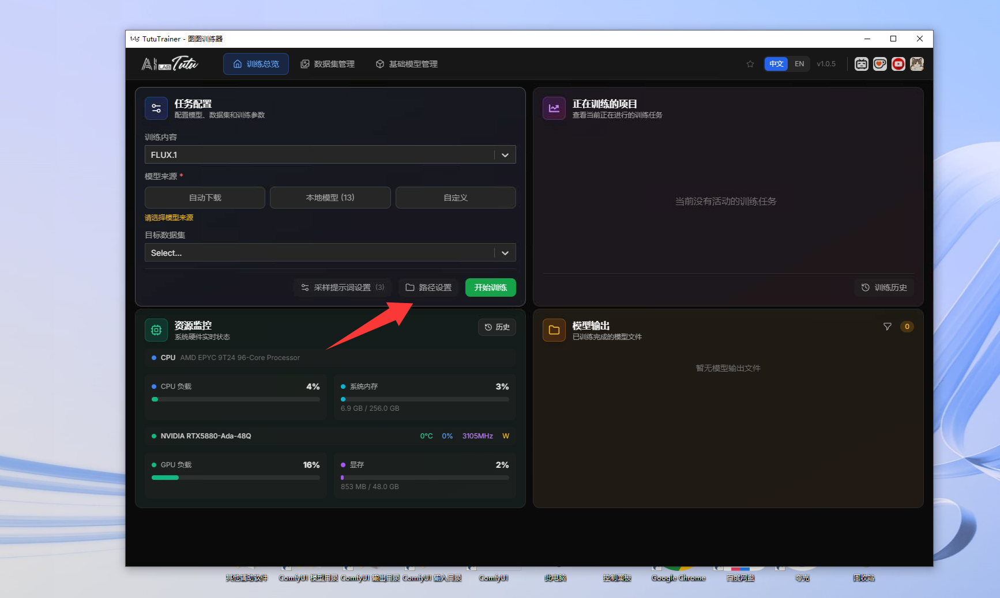
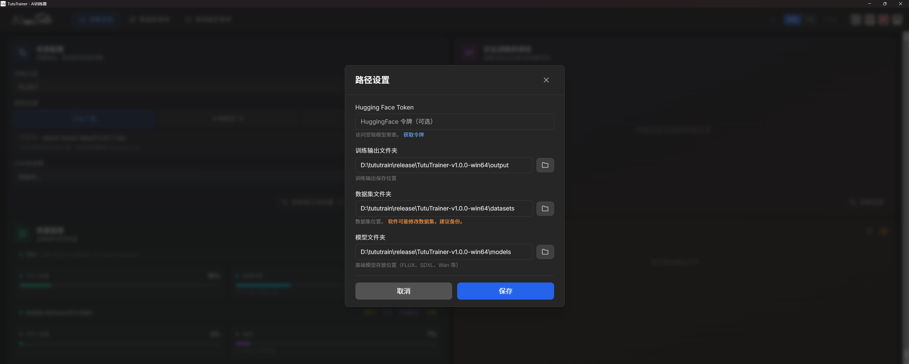
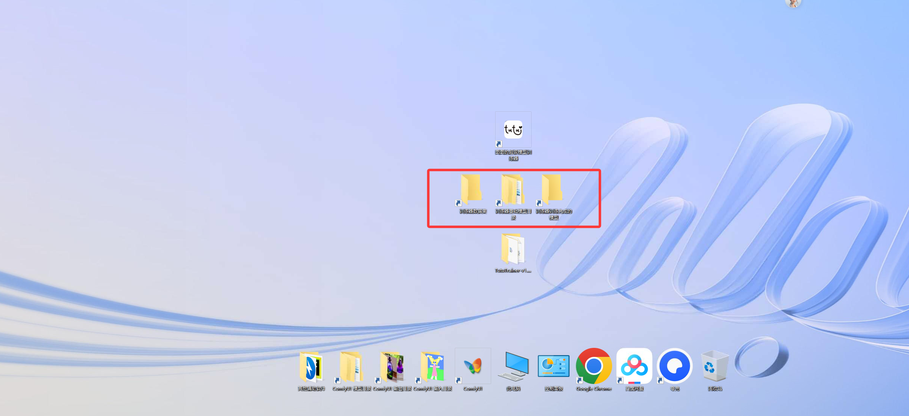
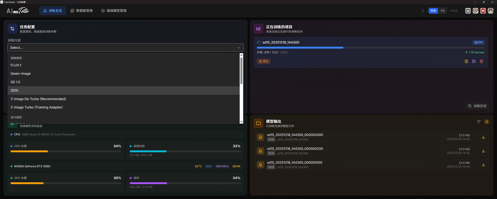

# TutuTrainer Cloud Image Guide

This guide explains how to use TutuTrainer in a cloud GPU image or mirrored Windows environment. It covers the same core training workflow as the desktop guide, with extra attention to cloud paths, uploaded datasets, model storage, output download, and cost control.

Use this guide when your local PC is not strong enough for the selected model family, when you want a repeatable clean environment, or when a cloud provider supplies a preconfigured TutuTrainer image.

## Contents

- [Quick Start](#quick-start)
- [System Requirements](#system-requirements)
- [Cloud Environment Notes](#cloud-environment-notes)
- [Interface Overview](#interface-overview)
- [Training Dashboard](#training-dashboard)
- [Dataset Management](#dataset-management)
- [Base Model Management](#base-model-management)
- [FAQ](#faq)
- [Best Practices](#best-practices)
- [Appendix](#appendix)

## Quick Start

### Step 1: Start the Cloud Machine and Configure Paths

1. Start the cloud GPU machine or open the provided cloud image.
2. Launch TutuTrainer from the desktop shortcut or installed application entry.
3. Wait for the interface to load.
4. Open path settings from the training dashboard.
5. Configure dataset, model, and output folders for the cloud disk layout.


Cloud paths are often different from your local PC. Always confirm paths before uploading data or starting a job.

| Path | What to check in a cloud image |
| --- | --- |
| Dataset folder | The folder where uploaded or mounted datasets will appear. |
| Model folder | The folder where downloaded or preloaded base models are stored. |
| Output folder | The folder you must download from before shutting down the instance. |

### Step 2: Prepare or Upload the Dataset

Open Dataset Management and create or select the dataset you want to train.



Then open the dataset detail page and confirm that images and captions are visible.



Each image should have a matching `.txt` caption file. If the dataset was uploaded as an archive, extract it before scanning.

For large datasets:

- Compress before upload when possible.
- Avoid duplicate files.
- Keep a local backup.
- Confirm the cloud disk has enough free space after extraction.

### Step 3: Configure and Start Training

1. Return to the Training Dashboard.
2. Choose the model architecture.
3. Choose the model source.
4. Select the target dataset.
5. Configure sample prompts if needed.
6. Start training.

TutuTrainer automatically calculates recommended training settings based on the selected model, dataset, and hardware situation.

### Step 4: Monitor and Download Results

Watch training progress, samples, logs, and GPU usage.



After training finishes:

1. Open the configured output folder.
2. Download the `.safetensors` LoRA files.
3. Download useful sample images and logs.
4. Verify the files are saved locally before shutting down the cloud machine.

Do not shut down or delete a temporary cloud instance before you have copied out the final outputs.

## System Requirements

Cloud instances still need enough GPU memory, system memory, disk space, and driver support for the selected model family.

### VRAM and Memory Guidance by Model

| Model family | Approximate VRAM | Approximate system memory | Typical GPU guidance |
| --- | --- | --- | --- |
| SD 1.5 | About 10 GB | Lower | RTX 3060 or better |
| SDXL | About 16 GB | About 16 GB | RTX 4070 or better |
| FLUX.1-dev | About 32 GB | 30 GB+ | RTX 5090 class |
| Qwen-Image | About 32 GB | 70 GB+ | RTX 5090 class with high system memory |
| Qwen-Image-Edit | About 32 GB | About 96 GB | RTX 5090 class with high system memory |
| Wan 2.2 5B (TI2V) | About 16 GB | About 64 GB | RTX 4070 or better |
| Wan 2.2 14B (T2V/I2V) | About 32 GB | About 96 GB | RTX 5090 or professional 24 GB+ GPU |
| FLUX Kontext | About 32 GB | About 50 GB | RTX 5090 or professional 24 GB+ GPU |
| LTX 2 | About 32 GB | About 64 GB | RTX 5090 class |
| FLUX2 Klein 4B | About 16 GB | About 64 GB | RTX 4070, RTX 4090, or RTX 5090 |
| FLUX2 Klein 9B | About 24 GB | About 64 GB | RTX 4090 or RTX 5090 |
| ERNIE-Image | About 24 GB | About 24 GB | RTX 3090 or better |

The actual requirement can change with dataset size, image resolution, model format, training method, and background processes.

## Cloud Environment Notes

### When to Use a Cloud GPU

Consider cloud GPU training when:

- Your local GPU runs out of VRAM.
- Your local system memory is not enough for the selected model.
- Training is too slow on your PC.
- You want to test a large model family without upgrading local hardware.
- You need a clean environment that can be recreated.

### Cost Control

Cloud GPU instances may charge for compute time, disk storage, snapshots, and network transfer.

Before training:

1. Confirm the hourly price.
2. Confirm disk storage pricing.
3. Upload only necessary files.
4. Stop or destroy the machine after outputs are downloaded.
5. Avoid leaving paid instances idle overnight.

### Data Safety

Treat third-party cloud machines as shared or temporary environments unless you fully control them.

Avoid storing:

- Private API keys.
- Browser cookies.
- Personal account files.
- Payment information.
- Unreleased customer data.

If you must use sensitive material, use a trusted provider and remove the files after the job is complete.

## Interface Overview

TutuTrainer uses the same main pages in local and cloud environments.

### Training Dashboard

| Area | Purpose |
| --- | --- |
| Job configuration | Choose model, dataset, prompts, and training workflow. |
| Resource monitor | Watch CPU, system memory, GPU usage, VRAM, temperature, clocks, and power. |
| Active jobs | View running jobs and stop a job if needed. |
| Model output | Find completed LoRA files and output folders. |

### Dataset Management

Use this page to create, scan, inspect, and edit datasets.

Cloud-specific checks:

- The dataset folder must be on a mounted or local cloud disk.
- Uploaded archives must be extracted.
- Captions must be copied together with images.
- The app must scan the same dataset root you uploaded into.

### Base Model Management

Use this page to scan, download, configure, and register base models.

Cloud-specific checks:

- Confirm the model folder is on a disk with enough space.
- Keep preloaded model folders intact.
- Refresh after moving, extracting, or mounting models.
- Download required model files before starting the paid training run if possible.

## Training Dashboard

### Model Source

In a cloud image, model source choices usually mean:

| Source | Cloud usage |
| --- | --- |
| Automatic download | Useful when the cloud image has internet access and model downloads are allowed. |
| Local model | Use when the model is already preloaded in the cloud image or extracted into the model folder. |
| Custom model | Use when the model is on a mounted drive or a non-standard path. |

### Supported Model Architectures

Image model families include:

- FLUX.1 and FLUX.1-dev.
- FLUX.1-Kontext-dev.
- Qwen-Image.
- Qwen-Image-Edit variants supported by your installed version.
- Stable Diffusion 1.5.
- Stable Diffusion XL.
- Z-Image family.
- FLUX2 Klein family.
- ERNIE-Image.

Video model families include:

- Wan 2.2 T2V 14B.
- Wan 2.2 I2V 14B.
- Wan 2.2 TI2V 5B.
- LTX 2 19B.

Use the in-app selector as the final source of truth because the supported list can change by version.

### Choosing a Model in the Cloud

For cloud usage, the best model is not always the largest model. Balance output quality, training time, hourly cost, and download size.

| Goal | Practical direction |
| --- | --- |
| Fast test | SD 1.5, SDXL, or a lower-memory model. |
| High-quality image LoRA | Use the model family that matches your target generation workflow. |
| Chinese prompt workflow | Qwen-Image or Z-Image may fit better. |
| Video LoRA | Use a matching video model and expect high time and storage cost. |

### Sample Prompts

Use sample prompts to monitor training quality without leaving the cloud app.

Good sample prompts:

- Reflect your final use case.
- Include one simple prompt and one more demanding prompt.
- Avoid adding too many unrelated elements.
- Stay consistent across checkpoints so comparison is meaningful.

### Resource Monitor

Cloud providers may expose different GPU names and driver states. Watch:

- VRAM usage.
- GPU load.
- Temperature.
- System memory.
- Disk space.
- Training speed.

If VRAM is full and speed is extremely slow, the model may be beyond the practical limit of the selected instance.

### Outputs

Before shutting down the instance, collect:

- Final LoRA checkpoint files.
- Intermediate checkpoints worth testing.
- Sample images.
- Training logs.
- Config files.

Keep at least one copy on your local machine or permanent storage.

## Dataset Management

### Uploading a Dataset

Common workflow:

1. Prepare the dataset locally.
2. Make sure captions are paired with images.
3. Compress the dataset folder.
4. Upload it to the cloud machine.
5. Extract it under the configured dataset folder.
6. Refresh Dataset Management in TutuTrainer.
7. Open the dataset detail page and inspect images and captions.

### Dataset Structure

Recommended structure:

```text
datasets/
|-- my_character/
|   |-- image001.jpg
|   |-- image001.txt
|   |-- image002.jpg
|   |-- image002.txt
```

Avoid deeply nested folders unless the app version explicitly supports them.

### Caption Checks

Captions should use the same base filename as the image.

```text
sample_001.png
sample_001.txt
```

If captions do not appear:

1. Check filenames.
2. Check extensions.
3. Check character encoding if files were edited by another program.
4. Refresh the dataset list.

## Base Model Management

### Preloaded Models

Some cloud images may include preloaded base models. Before downloading another copy:

1. Open Base Model Management.
2. Click refresh.
3. Check whether the model already exists.
4. Confirm the path and model type.

### Downloading Models

If the model is not preloaded:

1. Use the app-provided download link if available.
2. Download the model archive.
3. Extract it into the configured model folder.
4. Keep the expected folder structure.
5. Refresh the model list.

Large models can take a long time to download and extract. If the provider charges for time, prepare downloads before starting a long training job.

### Single-File and Separated Formats

Some models are a single `.safetensors` file. Others are separated folder-format models with several components.

If a custom merged model needs conversion, TutuTrainer may create an associated separated model for training. This does not change the original source file.

## FAQ

### Startup

#### The app opens to a blank window.

Wait 30 to 60 seconds on first launch. If it stays blank, check WebView2 Runtime, restart the app, and inspect logs if available.

#### The app cannot see my uploaded dataset.

Most likely causes:

1. The dataset was uploaded to a different folder.
2. The archive was not extracted.
3. The configured dataset root is wrong.
4. The folder contains unsupported file types.
5. The app has not refreshed the dataset list.

### Training

#### The job says queued but nothing is running.

Stop the job and start it again. If it repeats, check VRAM, system memory, Windows virtual memory, and the logs.

#### Why does a black console window appear?

This is normal for some backend training processes. Minimize it and let the training continue.


#### What is separated format?

Separated format is the standard folder-style model layout with multiple model components.


#### What is merged format?

Merged format is a single-file model layout, often distributed as one `.safetensors` file.

If a merged custom model is supported, TutuTrainer may convert it to a separated training format first. If you mark a merged model as separated format by mistake, training may fail.

After conversion, the app may show an associated model entry. Training uses the associated converted model while the original file remains unchanged.



#### Training is slow in the cloud.

Check:

1. Whether the GPU is actually being used.
2. Whether VRAM is full.
3. Whether the selected cloud instance is too small.
4. Whether the dataset or model is on slow network storage.
5. Whether the model is a video model or a high-memory image model.

Training speed varies heavily by model family and GPU class.

#### Sample images are poor.

Early samples can be poor. Review quality over multiple checkpoints.

Check:

1. Caption quality.
2. Dataset consistency.
3. Sample prompt quality.
4. Whether the model is undertrained or overtrained.

#### Which checkpoint should I use?

Test all saved checkpoints. The best checkpoint is often not the last one.

### File Management

#### Moving a large cached model looks stuck.

Large model files can take a long time to move, copy, or extract. Video model folders can be extremely large. Wait for the operation to complete and avoid starting additional file operations at the same time.

#### Captions are not associated with images.

Use matching filenames:

```text
image1.jpg
image1.txt
```

## Best Practices

### Before Training

1. Confirm the cloud instance type and cost.
2. Confirm the selected GPU has enough VRAM.
3. Confirm disk space before downloading large models.
4. Upload a clean dataset.
5. Verify captions in the app.
6. Configure output paths.

### During Training

1. Watch GPU usage and VRAM.
2. Check samples regularly.
3. Keep an eye on disk usage.
4. Stop early if the result is already good enough.
5. Save logs for failed jobs.

### After Training

1. Download all important LoRA files.
2. Download samples and logs.
3. Test checkpoints locally or in your target generation workflow.
4. Remove sensitive files from the cloud machine.
5. Stop or delete paid resources.

## Appendix

### Typical Folder Layout

The exact layout depends on the cloud image, but a practical structure is:

```text
TutuTrainer/
|-- TutuTrainer.exe
|-- backend/
|-- ui/
|-- node/
|-- config/

data/
|-- datasets/
|-- models/
|-- outputs/
```

### Useful Checks

If something does not appear in the app:

1. Confirm the folder path in path settings.
2. Confirm the file exists in File Explorer.
3. Confirm the file type is supported.
4. Refresh the relevant page.
5. Restart TutuTrainer if the cloud disk was mounted after the app started.

### Quick Links

Use the in-app icons when available:

- Bilibili tutorials.
- Ko-fi support.
- YouTube channel.
