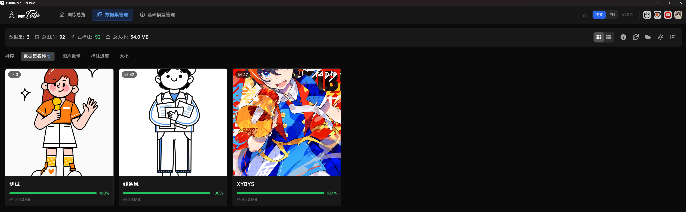
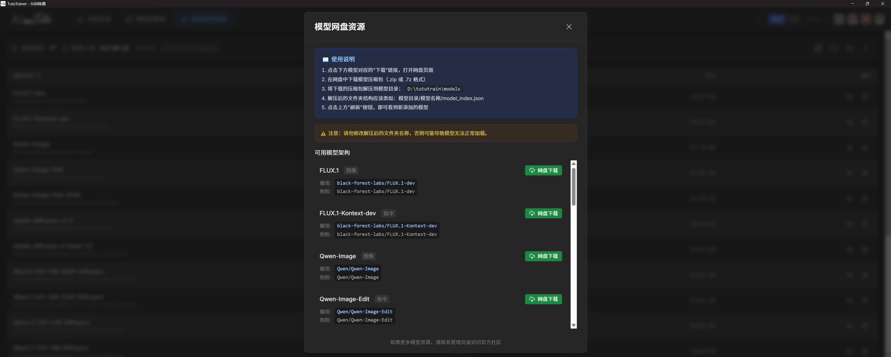
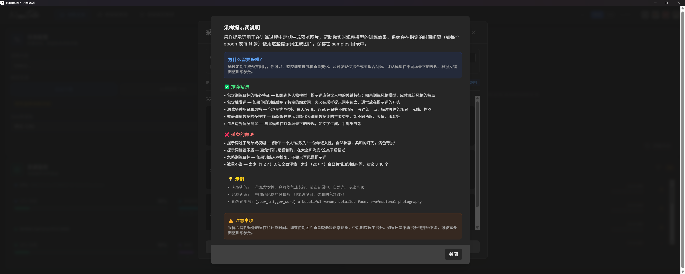

# Overview

> Bring AI model training back to what matters: simple, efficient, and professional.

Official download site: https://zhaotutu.xyz

Open the official site and choose the fully automated LoRA model trainer from the download area.

## Product Overview

TutuTrainer is AI model training software built for deep-learning enthusiasts, researchers, and AI practitioners. Its mission is to make complex AI training as simple as installing a game while preserving professional training capabilities.

## Core Value

Zero-barrier start. Broad model support. Intelligent training. Ready to use after installation.

Traditional AI training tools often require users to:

* Manually install Python, CUDA, and PyTorch.
* Configure complex environment variables.
* Debug dependency conflicts.
* Learn command-line parameters.
* Repeatedly test parameters to find a workable setup.

TutuTrainer is designed to remove that friction.

***

## Core Features

## 1. True Zero-Environment Setup

### One-click installation with no prerequisite environment

A typical training-tool setup may require:

```
1. Install Python and configure environment variables.
2. Install CUDA and verify driver compatibility.
3. Install PyTorch and choose the correct CUDA version.
4. Install many Python dependencies and resolve conflicts.
5. Configure a virtual environment to avoid polluting the system.
6. Hope everything runs correctly.
```

TutuTrainer setup is simpler:

```
1. Download TutuTrainer Setup.
2. Double-click the executable and open the app.
3. Start training.
Estimated time: 5-10 minutes.
```

| Feature               | TutuTrainer                 | Traditional Training Tools   |
| --------------------- | --------------------------- | ---------------------------- |
| Installation time     | 5-10 minutes                | 2-4 hours                    |
| Environment setup     | No manual configuration     | Requires technical knowledge |
| Dependency conflicts  | Avoided by packaged runtime | Common issue                 |
| System pollution      | Clean installation          | Multiple Python environments |
| Uninstall cleanliness | Clean uninstall             | Often leaves files           |
| Offline operation     | Fully supported             | Often needs network access   |

***

## 2. Broad Model Architecture Support

TutuTrainer is not a single-model trainer. It is a general AI training platform for image generation, video generation, and image editing models.

### Image Generation Models

| Model Family | Supported Versions | Minimum VRAM | Notes                                        |
| ------------ | ------------------ | ------------ | -------------------------------------------- |
| FLUX.1       | Dev / Schnell      | 24 GB        | High-end image generation models             |
| SD1.5        | Full series        | 8 GB         | Classic lightweight Stable Diffusion         |
| SDXL         | Base 1.0           | 16 GB        | High-quality Stable Diffusion XL             |
| Qwen-Image   | Base               | 24 GB        | Qwen image generation                        |
| Z-Image      | De-Turbo / Turbo   | 24 GB        | Fast image generation models                 |
| FLUX2 Klein  | 9B / 4B            | 16 GB        | New FLUX image editing and generation models |
| ERNIE-Image  | Baidu version      | 24 GB        | ERNIE image generation                       |

### Video Generation Models

| Model Family | Supported Versions      | Minimum VRAM | Notes                                                          |
| ------------ | ----------------------- | ------------ | -------------------------------------------------------------- |
| Wan 2.2      | 14B / I2V-14B / TI2V-5B | 24 GB        | MOE architecture with text-to-video and image-to-video support |
| LTX2         | 19B                     | 32 GB        | Audio-video synchronized model                                 |

### Instruction and Editing Models

| Model Family    | Supported Versions     | Minimum VRAM | Notes                                   |
| --------------- | ---------------------- | ------------ | --------------------------------------- |
| FLUX.1-Kontext  | Dev                    | 24 GB        | Context-aware editing based on FLUX     |
| Qwen-Image-Edit | 2511 / 2509 / original | 32 GB        | Precise instruction-based image editing |

### Dataset Format Support

* Image datasets such as PNG, JPG, and WEBP.
* Video datasets such as MP4, AVI, and MOV with automatic frame extraction.
* Control datasets such as ControlNet and multi-control workflows.
* Image-to-video datasets with first-frame extraction.
* Automatic resolution handling with intelligent cropping and scaling.
* Multi-resolution buckets for efficient training at different sizes.

***

## 3. Intelligent Training

### Automatic parameter optimization

Traditional training often forces users to decide:

```
learning_rate: 1e-4 or 1e-5?
batch_size: 1 or 4?
gradient_accumulation: how many steps?
optimizer: AdamW, Prodigy, or Adafactor?
lr_scheduler: constant, cosine, or polynomial?
timestep_sampling: uniform or shifted?
noise_offset: use it or not?
min_snr_gamma: 5 or disabled?
```

TutuTrainer's design is to let regular users choose the core training intent while the app handles the rest automatically. The user focuses on model architecture, model source, dataset, sample prompts, and paths. Training parameters are recommended by the app according to the selected model and task.

***

## 4. Modern Graphical Interface


### Training Dashboard

* Real-time training progress visualization.
* GPU usage, VRAM usage, and temperature monitoring.
* Automatic sample preview updates.
* Real-time training speed display.

### Task Management Center

* Visual configuration editor.
* Training task queue management.

### Smart File Management




* Automatic dataset scanning.
* Image preview grid.
* Caption file editing.
* Batch renaming tools.
* Dataset quality checks.

### Training History

* Training record archive.
* Hyperparameter comparison.
* Model version management.
* Training log replay.

### User Experience Details

* Responsive layout from 1080p to 4K.
* Dark theme for long working sessions.
* Smart desktop notifications after training completes.
* Automatic configuration saving.
* Global search for models and datasets.
* Keyboard shortcuts for advanced users.

***

## 5. Resource Ecosystem

### Built-in Resource Library

TutuTrainer provides model resources and supports one-click cloud-drive downloads.



### Automatic Model Download

Supported model sources include:

* Hugging Face Hub.
* ModelScope.
* Local paths for offline use.

Example automatic download flow:

```
Click New Training.
Choose FLUX.1-dev.
Check whether the model exists locally.
If not, download from the fastest source.
Show progress and estimated time.
Verify integrity after download.
```

### Built-in Help



* Hover tips for parameters.
* Visual examples.
* Best practices.
* Common issue guidance.

***

## 6. Reliable Training Protection

### Interrupted Training Recovery

* Automatic checkpoints.
* Resume after interruption.
* Multiple training versions retained.

### Logging

```
logs/
├── training_20241218_143052.log
├── system_20241218.log
├── error_20241218.log
```

***

## Target Users

### AI Art Creators

* Train personal art-style LoRAs.
* Create virtual characters and IP assets.
* Fine-tune commercial generation models.

### Video Creators

* Train video-style models.
* Customize image-to-video models.
* Learn motion effects.

### Researchers

* Quickly validate ideas.
* Manage comparison experiments.
* Reproduce paper results.

### Business Users

* Train on private data.
* Manage model assets.
* Schedule batch tasks.

***

## System Requirements

Recommended configuration:

* OS: Windows 10 64-bit, Build 17763 or later.
* GPU: NVIDIA RTX 4090 or better, 24 GB VRAM.
* Memory: 64 GB RAM.
* Storage: 50 GB free space, SSD recommended.

***

## Comparison with Traditional Command-Line Trainers

| Dimension               | TutuTrainer                | Traditional command-line tools |
| ----------------------- | -------------------------- | ------------------------------ |
| Installation difficulty | Double-click installer     | Expert setup                   |
| Graphical interface     | Modern web UI              | Usually none or basic          |
| Parameter tuning        | Automatic recommendations  | Manual documentation lookup    |
| Model support           | Broad architecture support | Depends on toolchain           |
| Training monitoring     | Real-time dashboard        | Terminal text                  |
| Error diagnosis         | Guided suggestions         | Manual troubleshooting         |
| Task management         | Queue system               | Often manual                   |
| Chinese support         | Fully localized            | Often English-first            |

***

## Installation and Quick Start

1. Download the package.
2. Run the app.
3. Start training.

Basic flow:

1. Choose the training target, such as FLUX.1-dev.
2. Choose the model source.
3. Choose the target dataset.
4. Click Start Training.

## Typical Scenario: Character LoRA

Goal: train a virtual IP character for a client.

Steps:

1. Prepare 30-50 character photos with different angles, expressions, and outfits.
2. Put them into a new dataset folder.
3. Open TutuTrainer and choose a suitable model architecture.
4. Select the dataset path.
5. Start training in automatic mode.
6. Wait for training to finish.
7. Find the trained LoRA in the output folder.

Expected result:

* The model can reproduce the character appearance.
* Character consistency is maintained.
* Pose, outfit, and background can still be controlled by prompts.

## Contact

* QQ: `331506796`
* WeChat: `tujiang0411`

## License

* Personal use: free.
* Commercial use: allowed. Keep the copyright notice.

## Start Now

Do not let complex environment configuration block your creativity.
