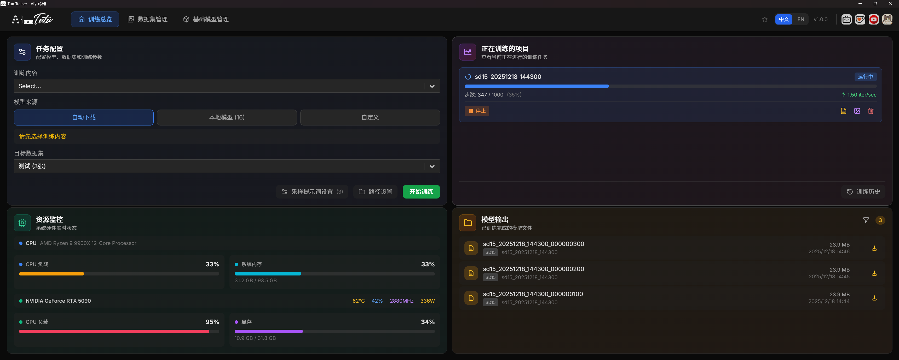
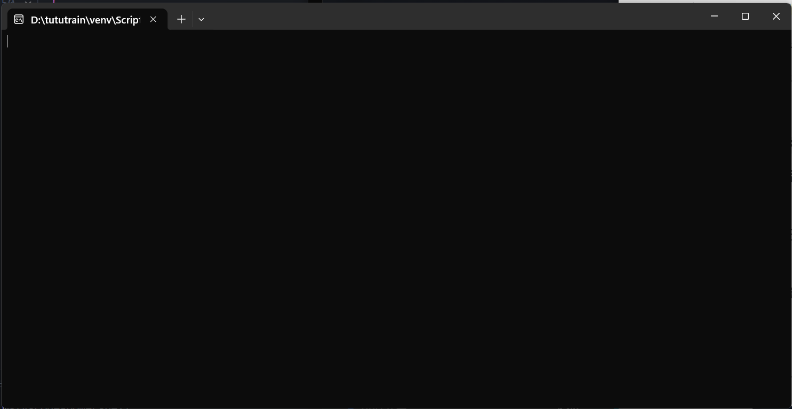
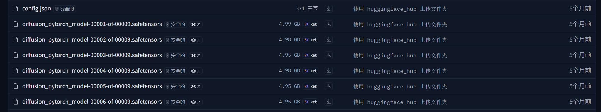

# User Guide

This guide walks through the normal TutuTrainer desktop workflow: installing the app, preparing a dataset, choosing a base model, starting LoRA training, monitoring progress, and using the finished model.

Official website: https://zhaotutu.xyz

## Contents

* [Download](user-guide.md#download)
* [Quick Start](user-guide.md#quick-start)
* [Auto Stop Timer](user-guide.md#auto-stop-timer)
* [System Requirements](user-guide.md#system-requirements)
* [Install and Start](user-guide.md#install-and-start)
* [Interface Overview](user-guide.md#interface-overview)
* [Training Dashboard](user-guide.md#training-dashboard)
* [Dataset Management](user-guide.md#dataset-management)
* [Base Model Management](user-guide.md#base-model-management)
* [FAQ](user-guide.md#faq)
* [Best Practices](user-guide.md#best-practices)
* [Appendix](user-guide.md#appendix)

## Download

Download the latest Windows installer from the official website:

https://zhaotutu.xyz

Open the website, go to the download area near the bottom of the page, and choose TutuTrainer.

Always use the official website or clearly announced official channels. Avoid repackaged installers, modified scripts, or marketplace resales.

## Quick Start

You can start a first LoRA training run in a few minutes once your paths, dataset, and base model are ready.

### Step 1: Configure Paths

1. Launch TutuTrainer from the desktop shortcut, Start menu, or installed `TutuTrainer.exe`.
2. Open the training dashboard.
3. Click the path settings button in the lower-right area of the dashboard.
4. Configure the dataset folder, model folder, and training output folder.
5. Save the path settings before creating or scanning datasets.

<figure><figcaption></figcaption></figure>

Recommended path roles:

| Path                   | Purpose                                               |
| ---------------------- | ----------------------------------------------------- |
| Dataset folder         | Stores all image datasets used for training.          |
| Model folder           | Stores downloaded, local, and configured base models. |
| Training output folder | Stores LoRA files, samples, logs, and job outputs.    |

If the UI cannot see your datasets or models, check these paths first. Most "not found" problems come from the app looking at a different root folder than the one you edited in File Explorer.

### Step 2: Prepare a Dataset

1. Open Dataset Manager from the top navigation.
2. Create a new dataset with a clear name.
3. Enter the dataset detail page.
4. Add image files to the dataset.
5. Write or import a caption file for each image.

<figure><figcaption></figcaption></figure>

Each training image should have a matching caption. TutuTrainer saves captions as `.txt` files with the same base filename as the image.

Example:

```
image001.jpg
image001.txt
```

For batch captioning, use Intelligent Image & Video Prompt Reverse Engineer to generate and review captions before training.

### Step 3: Configure and Start Training

1. Return to the Training Dashboard.
2. Choose the training type.
3. Choose the model architecture.
4. Choose the model source: automatic download, local model, or custom model.
5. Select the target dataset from the dataset dropdown.
6. Optionally configure sample prompts.
7. Click the start training button.

TutuTrainer calculates recommended training settings automatically based on the selected model, dataset, and available hardware. Normal users do not need to manually tune advanced parameters for a first run.

### Step 4: Review Results

During training, watch the job progress, resource usage, samples, and logs.

<figure><figcaption></figcaption></figure>

<figure><figcaption></figcaption></figure>

<figure><figcaption></figcaption></figure>

<figure><figcaption></figcaption></figure>


When the run is complete:

1. Open the model output area.
2. Review the generated `.safetensors` files.
3. Check the sample images and logs.
4. Test several checkpoints in your target generation workflow.

The final checkpoint is not always the best checkpoint. Test all saved checkpoints and choose the one that performs best for your target prompts.

## Auto Stop Timer

TutuTrainer includes an auto stop timer for active training jobs. In the Active Projects area, open the **Auto Stop (hours)** menu and choose a preset duration such as 2, 4, 8, 12, or 24 hours. You can also enter a custom hour and minute value, then click **Set**.

When the selected time limit is reached, TutuTrainer stops the training job automatically.

This feature is designed for normal training workflows where the configured step count is often intentionally generous. A job does not always need to run all the way to the final step. In many cases, the best checkpoint may appear earlier, and continuing for too long can waste GPU time or overtrain the result.

Use the timer when you want to:

* Limit overnight or long training runs.
* Stop a job after a fixed test window.
* Avoid using more GPU time than needed.
* Keep intermediate checkpoints while preventing the run from continuing indefinitely.

After the timer stops a job, review the saved samples and checkpoints. The timer controls training duration; it does not automatically decide which checkpoint is best.

## System Requirements

TutuTrainer is a Windows desktop application for local or cloud GPU LoRA training.

### Hardware Requirements

| Item             | Minimum                            | Recommended                                           |
| ---------------- | ---------------------------------- | ----------------------------------------------------- |
| Operating system | Windows 10/11, 64-bit              | Windows 11, 64-bit                                    |
| CPU              | Intel Core i5 or comparable        | Intel Core i7/i9 or AMD Ryzen 7/9                     |
| System memory    | 64 GB RAM                          | 96 GB RAM or more                                     |
| GPU              | NVIDIA GPU with 16 GB or more VRAM | RTX 5090, RTX 4090, or professional 24 GB+ NVIDIA GPU |
| Storage          | 100 GB free space                  | 500 GB+ NVMe SSD                                      |
| Driver           | NVIDIA driver 522.25 or newer      | Latest NVIDIA driver                                  |

### VRAM and Memory Guidance by Model

| Model family          | Approximate VRAM | Approximate system memory | Typical GPU guidance                   |
| --------------------- | ---------------- | ------------------------- | -------------------------------------- |
| SD 1.5                | About 10 GB      | Lower                     | RTX 3060 or better                     |
| SDXL                  | About 16 GB      | About 16 GB               | RTX 4070 or better                     |
| FLUX.1-dev            | About 32 GB      | 30 GB+                    | RTX 5090 class                         |
| Qwen-Image            | About 32 GB      | 70 GB+                    | RTX 5090 class with high system memory |
| Qwen-Image-Edit       | About 32 GB      | About 96 GB               | RTX 5090 class with high system memory |
| Wan 2.2 5B (TI2V)     | About 16 GB      | About 64 GB               | RTX 4070 or better                     |
| Wan 2.2 14B (T2V/I2V) | About 32 GB      | About 96 GB               | RTX 5090 or professional 24 GB+ GPU    |
| FLUX Kontext          | About 32 GB      | About 50 GB               | RTX 5090 or professional 24 GB+ GPU    |
| LTX 2                 | About 32 GB      | About 64 GB               | RTX 5090 class                         |
| FLUX2 Klein 4B        | About 16 GB      | About 64 GB               | RTX 4070, RTX 4090, or RTX 5090        |
| FLUX2 Klein 9B        | About 24 GB      | About 64 GB               | RTX 4090 or RTX 5090                   |
| ERNIE-Image           | About 24 GB      | About 24 GB               | RTX 3090 or better                     |

These numbers are practical guidance, not a strict guarantee. Dataset size, image resolution, model format, driver state, other running programs, and Windows virtual memory can all affect whether a job starts successfully.

## Install and Start

### Install

1. Download the latest installer from the official website.
2. Run the installer.
3. If Windows asks for WebView2 Runtime, install it.
4. If Windows reports missing runtime DLL files, install the Microsoft Visual C++ Redistributable.
5. Launch TutuTrainer after installation finishes.

### Start the App

1. Double-click the TutuTrainer shortcut or `TutuTrainer.exe`.
2. Wait for the interface to load. First launch can take 30 to 60 seconds.
3. Check the resource monitor area to confirm the GPU is visible.
4. Configure paths before starting the first training run.

## Interface Overview

TutuTrainer has three main working pages in the top navigation.

### Training Dashboard

This is the main page used for training.

| Area              | Typical position | Purpose                                                                    |
| ----------------- | ---------------- | -------------------------------------------------------------------------- |
| Job configuration | Upper-left       | Choose training type, model, dataset, and sample prompts.                  |
| Resource monitor  | Lower-left       | Shows CPU, system memory, GPU usage, VRAM, temperature, clocks, and power. |
| Active jobs       | Upper-right      | Shows current training progress and allows stopping a job.                 |
| Model output      | Lower-right      | Lists finished model files and output folders.                             |

### Dataset Management

Use this page to manage training datasets.

* View all datasets.
* Create or remove datasets.
* Open dataset folders in File Explorer.
* Enter a dataset detail page to edit captions.
* Add images and inspect caption status.

### Base Model Management

Use this page to manage base models.

* View downloaded models.
* Download models from official cloud-drive links when provided.
* Add custom local models.
* Configure single-file model formats.
* Refresh model scanning after moving files.

## Training Dashboard

### Training Type

The default workflow is LoRA training. It is suitable for teaching a model a character, person, product, object, style, visual concept, or motion-related target depending on the selected model family.

### Model Source

TutuTrainer supports three normal ways to select a base model.

| Source             | When to use it                                                                                       |
| ------------------ | ---------------------------------------------------------------------------------------------------- |
| Automatic download | Use this when you want the app to download required files if they are not already available locally. |
| Local model        | Use this when the model has already been downloaded into the model folder.                           |
| Custom model       | Use this when the model lives outside the standard folder or needs manual component configuration.   |

### Supported Model Architectures

Image model families include:

* FLUX.1 and FLUX.1-dev.
* FLUX.1-Kontext-dev.
* Qwen-Image.
* Qwen-Image-Edit, including newer edit variants when supported by the installed version.
* Stable Diffusion 1.5.
* Stable Diffusion XL.
* Z-Image family.
* FLUX2 Klein family.
* ERNIE-Image.

Video model families include:

* Wan 2.2 T2V 14B.
* Wan 2.2 I2V 14B.
* Wan 2.2 TI2V 5B.
* LTX 2 19B.

The exact list in your app may change by version. Use the in-app model selector as the final source of truth.

### Choosing a Model

Choose by hardware first, then by training goal.

| Goal                     | Practical direction                                                         |
| ------------------------ | --------------------------------------------------------------------------- |
| First test run           | Start with SD 1.5, SDXL, or another lower-memory option.                    |
| Character or person LoRA | Use a model family that works well for your target generation workflow.     |
| Style LoRA               | Most image model families can work if the dataset is consistent.            |
| Chinese prompts          | Qwen-Image and Z-Image are commonly selected for Chinese prompt workflows.  |
| Video LoRA               | Use the matching video model family and expect higher time and memory cost. |

### Target Dataset

The dataset dropdown lists created datasets. A dataset usually appears as a name plus image count.

If a dataset is missing:

1. Confirm the dataset folder is under the configured dataset root.
2. Confirm it contains supported image files.
3. Refresh the dataset list.
4. Reopen path settings if the app is scanning a different folder.

### Sample Prompts

Sample prompts are used to generate preview images during training.

* Open the sample prompt settings from the dashboard.
* Use preset prompts or write your own.
* Keep sample prompts close to the final use case.
* Use both simple and stress-test prompts if you want to judge generalization.
* Translation tools may be available in the app depending on version.

### Path Settings

The path settings control where the app reads and writes important files.

| Setting                | What it affects                                            |
| ---------------------- | ---------------------------------------------------------- |
| Training output folder | LoRA outputs, samples, logs, and job files.                |
| Dataset folder         | Dataset discovery and dataset creation.                    |
| Model folder           | Base model discovery, downloads, and local model scanning. |

Check paths before large jobs, especially if you use external drives, cloud disks, or multiple TutuTrainer installations.

### Start Training

After you click start:

1. The app calculates recommended parameters.
2. A job name is created automatically.
3. The job appears in Active Jobs.
4. Logs and samples begin updating as training progresses.

If the app says the job is queued but no other job is running, stop the job and start it again. This can happen rarely when memory, VRAM, or virtual memory is in a bad state.

### Resource Monitor

The resource monitor shows live hardware status.

Typical fields include:

* CPU usage.
* System memory usage.
* GPU usage.
* VRAM usage.
* GPU temperature.
* GPU clocks.
* GPU power.

If GPU usage stays very low after training starts, check the logs and make sure the job actually entered the training stage.

### Active Jobs

The active job card shows:

* Job name.
* Current step and total steps.
* Progress bar.
* Training speed.
* Stop button.

Click a job card to open the detail page.

The detail page commonly includes:

* Overview: job summary and logs.
* Samples: generated sample images.
* Config File: full configuration used for that run.

### Model Output

The output area lists finished model files.

You can usually see:

* Filename.
* File size.
* Related job.
* Creation time.
* Download or copy action.
* Open-folder action.

Outputs can be sorted or filtered depending on the app version.

## Dataset Management

### Dataset List

The dataset list page summarizes the dataset root.

Common statistics:

* Total dataset count.
* Total image count.
* Captioned image count.
* Total file size.

Common actions:

* Open guide.
* Refresh.
* Open dataset folder.
* Open captioning tool.
* Create dataset.

### View Modes

Grid view shows dataset cards and preview images.

List view shows more table-like detail for scanning names, counts, and status.

### Dataset Detail Page

The dataset detail page shows the images in one dataset.

Common functions:

* View all images.
* See caption status.
* Search or filter images.
* Filter by captioned or uncaptained status.
* Add images.
* Open an image viewer.
* Edit captions.

### Add Images

1. Click the add-image action.
2. Select one or more files.
3. Use JPG, JPEG, or PNG.
4. Wait for the app to copy or register the files.
5. Confirm the images appear in the dataset detail page.

### Edit Captions

Click an image card to open the viewer, then edit the caption in the side panel.

Captions are automatically saved as `.txt` files with the same base filename.

Example:

```
portrait_0001.png
portrait_0001.txt
```

### Image Requirements

Recommended image properties:

* Format: JPG, JPEG, or PNG.
* Resolution: usually 512x512 to 2048x2048 is practical.
* Quality: clear, sharp, and not heavily compressed.
* Content: aligned with the concept you want the LoRA to learn.
* Quantity: enough variation to learn the target without burying it in unrelated material.

Remove images that are blurry, duplicated, misleading, watermarked in a harmful way, or unrelated to the training target.

### Caption Writing

Each image should have a caption that describes what is actually visible.

Person or character example:

```
a young woman with long black hair, wearing a white dress, sitting on a bench, park background, natural lighting, upper body shot
```

Style example:

```
oil painting of a mountain landscape, impressionist style, warm colors, soft brushstrokes, sunset lighting
```

Good captions are consistent but not fake. Do not force a tag into every image unless the concept is actually present or you intentionally use a trigger word strategy.

## Base Model Management

### Model List

The model manager lists recognized base models.

| Column     | Meaning                                                            |
| ---------- | ------------------------------------------------------------------ |
| Model name | Display name and storage path.                                     |
| Type       | Diffusers-style folder format or single-file format.               |
| Source     | Local, cache, download, or custom source.                          |
| Size       | Model file or folder size.                                         |
| Actions    | Configure, edit, open, refresh, or remove depending on model type. |

### Common Actions

* Refresh: scan the model folder again.
* Open folder: open the model folder in File Explorer.
* Cloud-drive download: open provided model download links.
* Add custom model: register a model outside the standard folder.

### Download a Model

1. Click the cloud-drive download action if your installed version provides it.
2. Find the model you need.
3. Open the download link.
4. Download the archive, usually `.zip` or `.7z`.
5. Extract it into the model folder.
6. Preserve the expected folder structure.
7. Return to TutuTrainer and click refresh.

Large video models can be very large. Moving or extracting them can take several minutes or much longer on slower disks.

### Single-File Model Configuration

Some models are distributed as a single `.safetensors` file. If TutuTrainer needs component paths, configure the model before training.

1. Click the configure action beside the model.
2. Choose the correct model architecture.
3. Specify required component files.
4. Save the configuration.
5. Refresh or return to the dashboard before starting training.

### Custom Models

Use a custom model when the model is not in the standard model folder.

1. Click Add Custom Model.
2. Enter a clear model name.
3. Choose the model type.
4. Select the model path or component files.
5. Save the model.

If you are unsure whether a model is a folder-format model or a single-file model, use automatic download first or compare the folder structure with a known working model.

## FAQ

### Install and Startup

#### How do I update to the latest version?

TutuTrainer includes an in-app update flow. When an update notice appears, follow the prompt to download and install it. If the in-app update fails, retry or download the latest installer from the official website.

#### Windows says WebView2 Runtime is missing. What should I do?

Install Microsoft WebView2 Runtime. Some installers include a `WebView2Installer.exe`; otherwise download it from Microsoft.

#### Windows reports missing DLL files. What should I do?

Install the Microsoft Visual C++ Redistributable for x64 Windows. A common official Microsoft link is:

https://aka.ms/vs/17/release/vc\_redist.x64.exe

#### The window is blank after launch.

Wait 30 to 60 seconds on first launch. If the window stays blank, install or repair WebView2 Runtime, then restart the app.

### GPU and Memory

#### The app cannot detect my GPU.

Check the following:

1. Install or update the NVIDIA driver.
2. Run `nvidia-smi` in a terminal and confirm Windows can see the GPU.
3. Confirm the installed driver is new enough for the selected model workflow.
4. Restart TutuTrainer after driver changes.

#### Training fails with out-of-memory errors.

Try the following:

1. Choose a lighter model family.
2. Close other GPU-heavy applications.
3. Make sure Windows virtual memory is large enough.
4. Use a machine with more VRAM or system memory for high-memory models.

### Training

#### The job says queued, but there is no job in front of it and the logs are empty.

Stop the job and start it again. This can happen rarely when VRAM, system memory, or virtual memory is not in a good state.

#### What does "OSError: page file is too small to complete the operation" mean?

Windows ran out of usable memory or virtual memory. Increase system memory if possible, increase Windows virtual memory, close other programs, and reboot before trying again.

#### Why does a black console window appear when training starts?

This is normal for some training processes. Minimize it and let the job continue.



#### What is the difference between separated format and merged format?

Separated format is the standard folder-style model layout used by many diffusion model repositories. The model is split into multiple component folders and files.



Merged format is a single-file model format, commonly seen in ComfyUI workflows as one `.safetensors` file.

When you add a custom merged model, TutuTrainer may convert it into the separated standard format before training. If required files are missing, the app may download missing components when the workflow supports it.

Important notes:

1. If you incorrectly mark a merged model as separated format when adding a custom model, the app will not convert it and training may fail.
2. If you are not familiar with model formats, use automatic download first.
3. After a merged model is converted, the app may show an associated separated model. Training uses that associated model. The conversion does not modify the original source file.



#### Training is very slow.

AI training is compute-heavy. If the selected model is close to or beyond your hardware limit, the app may use aggressive memory-saving behavior and training can become much slower.

Things to check:

1. Whether GPU usage is near 100 percent.
2. Whether VRAM is full.
3. Whether the selected model family is too large for the machine.
4. Whether you are training a video model, which is usually slower than image models.

For example, the same Z-Image training job may take many hours on a 16 GB GPU but much less time on a high-end GPU.

#### Sample images look bad.

Early samples often look bad. Quality should improve as training progresses.

Check:

1. Whether sample prompts match your target use case.
2. Whether captions are accurate.
3. Whether the dataset quality is good.
4. Whether the checkpoint is undertrained or overtrained.

Always test the finished LoRA in your actual generation workflow before deciding it failed.

#### I cannot find the trained model.

The model is saved under the training output folder configured in path settings. You can also use the model output area to download the file or open the output folder.

#### Which of the saved checkpoints is best?

You need to test all checkpoints. The best checkpoint is often not the final one. The final checkpoint may be overtrained.

### Dataset and Model Files

#### Moving or copying a cached model keeps showing "processing". Is the app frozen?

Usually no. Moving or copying large model files is slow, especially for video models that can be tens of gigabytes or more. On mechanical hard drives it can take much longer. Do not start other file operations while it is processing; wait for the operation to finish.

#### The dataset scanner cannot find my images.

Check:

1. The images are JPG, JPEG, or PNG.
2. The dataset is inside the configured dataset folder.
3. The dataset has a normal folder name.
4. You clicked refresh after adding files.

#### Captions are not associated with images.

Caption files must have the same base filename as the image and use the `.txt` extension.

```
image1.jpg
image1.txt
```

## Best Practices

### Choose the Right Model

| Scenario                  | Recommended direction           | Why                                                           |
| ------------------------- | ------------------------------- | ------------------------------------------------------------- |
| First experiment          | SD 1.5, SDXL, or Z-Image        | Lower memory requirement and faster feedback.                 |
| Character or person LoRA  | Z-Image or FLUX2 Klein family   | Strong general image quality when hardware allows.            |
| Style LoRA                | Any suitable image model family | Dataset consistency matters more than brand-new model choice. |
| Chinese prompt workflow   | Qwen-Image or Z-Image           | Better fit for Chinese-language prompting workflows.          |
| Limited VRAM, 10 to 16 GB | SD 1.5 or SDXL                  | More practical on lower-memory GPUs.                          |
| Video training            | Wan 2.2 5B                      | More practical than larger video model families.              |

### Prepare Datasets Carefully

1. Keep the dataset focused on one target concept.
2. Prefer fewer high-quality images over many weak images.
3. Use accurate captions. Tutu Super Smart Tagger can help generate and review captions in batches.
4. Include moderate variation in pose, angle, expression, lighting, or background when it helps the target.
5. Remove images that teach the wrong thing.

### Monitor Training

1. Watch sample images during training.
2. Watch GPU usage, VRAM, and temperature.
3. Keep multiple checkpoints.
4. Stop early if the model has already reached the desired result.
5. Save logs when diagnosing failed jobs.

### Use Results

The finished `.safetensors` LoRA file can usually be used in tools that support LoRA loading, such as:

* ComfyUI.
* Stable Diffusion WebUI variants.
* Fooocus.
* Other LoRA-compatible generation tools.

Test the LoRA with simple prompts first, then move to more complex final prompts.

## Appendix

### Installed Directory Structure

Typical installation folders may include:

```
TutuTrainer/
|-- TutuTrainer.exe
|-- WebView2Installer.exe
|-- backend/
|-- ui/
|-- node/
|-- config/
|   |-- accuracy_recovery_adapters/
```

The exact folder layout can change by version.

### Default Data Locations

The main data folders are controlled by path settings:

* Dataset folder.
* Model folder.
* Training output folder.
* Logs folder.

If you need support, keep the relevant logs and the job configuration file.

### Quick Links

Use the icons in the upper-right area of the app when available:

* Bilibili tutorials.
* Ko-fi support.
* YouTube channel.

### Support

If you need help, check the logs first, then contact the official support channel listed by Zhaotutu.

Public contact information from the original Chinese guide:

* QQ: 331506796
* WeChat: tujiang0411
