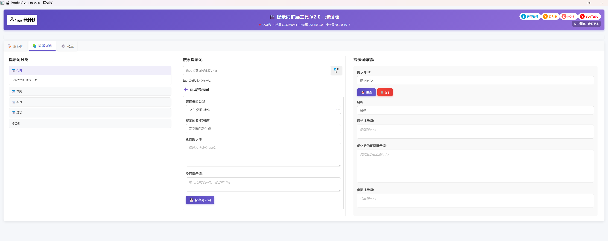
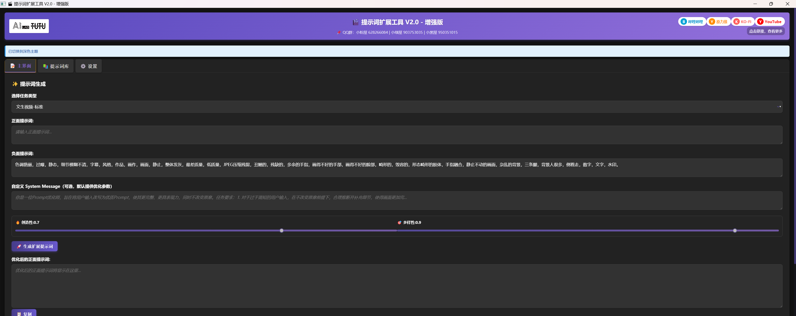

# User Guide

Tutu Video Prompt Tool V2.0 is an AI video prompt expansion tool for text-to-video and image-to-video creation. It helps users turn short ideas into more complete prompts with subject, scene, camera, lighting, motion, style, and negative prompt guidance.






## Contact and Official Channels

* Official website: https://zhaotutu.xyz
* Bilibili: https://space.bilibili.com/431046154
* Liblib: https://liblib.art/userpage/08e92accf66b9dd83b33d939fc8dc405/publish
* V1.0 open-source page: https://github.com/zhaotututu/prompt-expander
* Ko-fi: https://ko-fi.com/zhaotutu

Community groups from the original Chinese guide:

* QQ group 628266084
* QQ group 950351015
* QQ group 903753035

## Product Introduction

Tutu Video Prompt Tool V2.0 uses Qwen-based text and vision models to optimize prompts for text-to-video and image-to-video generation. It can expand a short idea into a more accurate, vivid, and structured prompt.

Compared with V1.0, V2.0 upgrades the interface, prompt library, custom settings, bilingual experience, and installation workflow.

## Main Features

* Dual mode: text-to-video and image-to-video prompt expansion.
* Style templates: standard, anime, cinematic, realistic, and other templates depending on version.
* Prompt library: generated prompts are saved and categorized.
* AI naming: generated prompts can receive meaningful names automatically.
* Bilingual interface: Chinese and English UI can be switched.
* Dark and light themes: choose the theme that fits your working environment.
* Custom templates: create and save custom system prompt templates.
* One-click apply: apply prompts from the library to the generator when supported by the installed version.

## V2.0 Upgrade Highlights

### New User Interface

* Redesigned layout for easier operation.
* Dark and light theme support.
* Better display on desktop and smaller screens.
* Improved status prompts and error feedback.

### Stronger Workflow Features

* New prompt library.
* Time and type classification.
* Search for saved prompts.
* AI automatic naming.
* Custom templates for personalized workflows.

### Language and Experience Improvements

* Full Chinese and English interface support.
* Instant language switching.
* Improved image upload and preview.
* Better prompt editing and updating.
* Clearer progress and status feedback.

### Architecture Improvements

* PyQt5-based interface for a smoother desktop experience.
* Optimized API communication.
* Improved error handling and recovery.
* Safer local data storage and prompt management.

### New Settings

* API key management.
* Custom system prompt templates.
* Default negative prompt settings.
* Theme settings.
* Saved language preferences.

## Feature Details

### Text-to-Video Prompt Optimization

Text-to-video mode turns a simple text idea into a structured video prompt.

Typical workflow:

1. Choose text-to-video mode.
2. Enter a positive prompt.
3. Optionally enter a negative prompt.
4. Choose a style template.
5. Adjust creativity and diversity settings.
6. Click Generate Expanded Prompt.
7. Review, edit, copy, or save the result.

Style templates may include:

* Standard.
* Anime.
* Cinematic.
* Realistic.

Example short prompt:

```
a girl dancing
```

Example expanded direction:

```
documentary photography style, a young East Asian girl wearing a flowing white dress dances in an open square at dusk, smooth medium-shot tracking movement, soft natural light, orange sunset background, hair and skirt moving naturally in the wind, graceful motion with strong visual rhythm
```

### Image-to-Video Prompt Optimization

Image-to-video mode generates a video prompt from an uploaded image and optional text guidance.

Typical workflow:

1. Choose image-to-video mode.
2. Upload an image.
3. Add a short text direction if needed.
4. Choose a style template.
5. Adjust parameters.
6. Generate the expanded prompt.
7. Review whether the result preserves the source image.

The tool can help identify:

* Subject characteristics.
* Colors.
* Composition.
* Visual style.
* Lighting.
* Elements that should remain consistent.
* Motion or camera direction suitable for video generation.

For example, after uploading an anime character image, the generated prompt may include anime rendering, cel-shading, light effects, and motion details.

### Prompt Library Management

The prompt library stores generated prompts for reuse.

Supported behavior:

* Automatically save generated prompts.
* Browse by date: today, this week, this month, and all.
* Browse by type: text-to-video, image-to-video, and subcategories.
* Search for specific prompts.
* View saved prompts.
* Edit and update saved prompts.
* Delete prompts that are no longer useful.
* Preview the original image for image-to-video records.
* Apply a saved prompt back to the generator when supported.

Use the library to compare which prompt structures actually worked with your target video model.

### Custom Settings

The settings page can include:

* Language: switch between Chinese and English.
* Theme: switch between dark and light themes.
* API key management: configure and save your model service API key.
* Template management: create, edit, and restore system prompt templates.
* Negative prompt: customize the default negative prompt.

## Install and Use

### System Requirements

* Windows 10 or Windows 11.
* At least 2 GB free disk space.
* Network access for API calls.
* A DashScope API key or the API key required by the installed version.

The normal installer does not require Python knowledge, code setup, or manual environment configuration.

### Simple Installer Workflow

1. Download the latest installer from the official release or official download channel.
2. Run the `.exe` installer.
3. Follow the on-screen instructions.
4. Launch the app from the desktop shortcut or Start menu.
5. Open settings and configure your API key.

## Basic Usage Flow

1. Select the task type: text-to-video or image-to-video.
2. Enter the positive prompt.
3. Enter a negative prompt if needed.
4. Upload an image if using image-to-video mode.
5. Adjust creativity and diversity parameters.
6. Click Generate Expanded Prompt.
7. Review the generated result.
8. Copy, apply, edit, or save the prompt.

## API Key Setup

The original guide uses a DashScope model service workflow.

General steps:

1. Visit the model service platform required by your installed version.
2. Register and sign in.
3. Open API key management.
4. Create a new API key.
5. Copy the API key.
6. Paste it into the tool settings.
7. Save the setting and test generation.

Protect your API key. Do not share screenshots that expose it.

## FAQ

### Do I need an API key?

Yes, for workflows that call an external model service. Some providers may offer free quota, but quota and pricing are controlled by the provider and may change.

### The generated prompt is not stable. What should I do?

Try:

* Lowering or raising creativity parameters.
* Switching style templates.
* Simplifying the input prompt.
* Adding clearer subject or motion guidance.
* Editing the generated result manually before use.
* Testing the same prompt in your target video model.

### The prompt is too long for my video model.

Shorten it by removing secondary details, repeated style words, or overly complex camera directions. Some video models prefer concise prompts.

### The image-to-video result ignores the uploaded image.

Check whether the generated prompt clearly preserves the subject, style, colors, and composition of the source image. Add explicit consistency guidance if needed.

### Can I use the prompt library as a project library?

Yes. Save useful prompts and organize them by time, type, or project. Keeping a history helps you learn which prompt structures work best.

## Future Plans

The original V2.0 guide mentions ongoing improvements, including:

* Support for more AI service providers.
* More local model options.
* Continued UI and workflow refinements.

## License

The V1.0 open-source project uses the MIT License. For V2.0 installer usage and distribution, follow the license or terms provided with the current release channel.

## Development Status

The project is actively maintained. If you encounter bugs, contact Zhaotutu through the official channel or in-app feedback path when available.

## Acknowledgements

Thanks to:

* Users who provided feedback.
* Contributors who helped improve the tool.
* The Qwen model team for the underlying AI model capabilities used by the original workflow.
